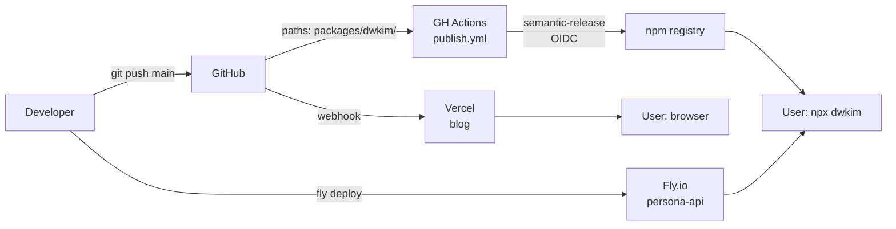

# Deployment Overview

> 이 문서는 3개 패키지 배포의 **인덱스**. 상세 runbook 은 각 패키지 루트의 `DEPLOY.md` 참조.

## Deployment Matrix

| Package | Target | Trigger | Automation |
|---------|--------|---------|------------|
| [`packages/dwkim`](./packages/dwkim/DEPLOY.md) | npm registry (`dwkim`) | push to `main` + paths filter | ✅ semantic-release via GH Actions |
| [`packages/persona-api`](./packages/persona-api/DEPLOY.md) | Fly.io (`persona-api`, region `nrt`) | 수동 (`fly deploy`) | ❌ manual |
| [`packages/blog`](./packages/blog/DEPLOY.md) | Vercel | push to `main` | ✅ Vercel GitHub integration |

추가 infra: Fly.io sister app `persona-qdrant` (벡터 DB, `min_machines_running = 1` → cold start 없음).

## Architecture (Deploy-time view)



## Global Prerequisites

다음 도구와 계정이 모든 배포에 공통 필요:

### Tools
- [ ] [Bun](https://bun.sh) 1.3+ — 로컬 빌드/개발 (root 모노레포는 Bun workspace)
- [ ] [Node.js](https://nodejs.org) 22+ — semantic-release CI 환경과 일치시키기
- [ ] [flyctl](https://fly.io/docs/hands-on/install-flyctl/) — persona-api 수동 배포
- [ ] [GitHub CLI `gh`](https://cli.github.com/) (선택) — PR/릴리즈 조회
- [ ] [Git](https://git-scm.com) 2.40+

### Accounts & Auth
- [ ] GitHub 계정 (레포 write 권한)
- [ ] Fly.io 계정 (`fly auth login`)
- [ ] Vercel 계정 (GitHub 통합으로 자동)
- [ ] npm 계정 (CI 가 OIDC 로 인증 — 로컬 수동 publish 는 npm 토큰 필요)

### GitHub Secrets (레포 settings → Secrets and variables → Actions)
| Secret | 사용처 | 필수 | 획득 |
|--------|--------|------|------|
| `NPM_TOKEN` | `publish.yml` | ✅ | [npmjs.com 토큰](https://docs.npmjs.com/creating-and-viewing-access-tokens) (Automation 타입) |
| `GITHUB_TOKEN` | 모든 workflow | 자동 | GitHub 자동 주입 |
| (Claude bot) | `claude*.yml` | 선택 | Anthropic API key — 자동 리뷰 사용 시 |

## Common Deployment Cycle

```bash
# 1. 작업
git checkout -b feature/xxx
# ... 변경 ...

# 2. Conventional commit (필수 — semantic-release 가 버전 결정)
git commit -m "feat(dwkim): new thing"   # minor bump
git commit -m "fix(persona-api): ..."    # patch
git commit -m "docs(blog): ..."          # no release

# 3. PR → review → merge to main
gh pr create --fill
gh pr merge --squash   # main 에 squash

# 4. 배포 트리거
#    - dwkim:     push 자동 (publish.yml)
#    - blog:      push 자동 (Vercel)
#    - persona-api: 수동 'fly deploy' (packages/persona-api/)
```

## Post-Deploy Verification (공통)

```bash
# persona-api
curl -s https://persona-api.fly.dev/health | jq

# blog
curl -sI https://dwkim.dev | head -5

# dwkim CLI (최신 버전 확인)
npm view dwkim version
npx dwkim --version  # TODO: --version 플래그 제공 시
```

## Known Quirks (공통 인지 필요)

- **persona-api cold start**: Fly 머신이 `auto_stop_machines = "stop"` + `min_machines_running = 0` → 유휴 후 첫 요청 ~4-5초. **서버 다운 아님**. 상세: `packages/persona-api/DEPLOY.md#cold-start`.
- **semantic-release commit-back**: `publish.yml` 실행 시 `chore(dwkim): release x.y.z [skip ci]` 커밋이 추가로 생김. git pull 필요.
- **Vercel builds 공유 쿼터**: 무료 플랜 기준 월 100 builds/팀. 루트 push 마다 트리거.
- **Fly.io 리전**: `nrt` (Tokyo) — 한국 사용자 레이턴시 최소화 목적.

## Incident Response 공통

| 증상 | 1차 확인 | 출처 |
|------|----------|------|
| "CLI 가 응답 없음" | `curl https://persona-api.fly.dev/health` → cold start 가능성 | `packages/persona-api/DEPLOY.md#incident-response` |
| "블로그 이전 버전 표시" | Vercel 캐시 / 빌드 실패 확인 | `packages/blog/DEPLOY.md#incident-response` |
| "npm 최신 버전 아님" | GH Actions `publish.yml` run 확인, conventional commit 형식 확인 | `packages/dwkim/DEPLOY.md#incident-response` |

## Further Reading

- 아키텍처 전체: [CLAUDE.md](./CLAUDE.md)
- RE 분석: `harness-docs/inception/reverse-engineering/`
- 배포 요구사항: `harness-docs/inception/requirements/requirements.md`

---
*Last updated: 2026-04-21 (generated by Harness workflow)*
