```mermaid
flowchart LR
A["1943: McCulloch & Pitts|A Logical Calculus of the Ideas Imminent in Nervous Activity [1]"]
A --> B["1948: Norbert Wiener|Cybernetics"]
B --> C["1950: Alan Turing|Computing Machinery and Intelligence"]
C --> D["1951: Marvin Minsky & Dean Edmonds|SNARC (최초의 신경망 컴퓨터)"]
D --> E["1958: Frank Rosenblatt|Perceptron"]
E --> F["1960: Bernard Widrow & Marcian Hoff|ADALINE, MADALINE"]
F --> G["1969: Marvin Minsky & Seymour Papert|Perceptrons (한계 지적)"]
G --> H["1974: Paul Werbos|Backpropagation 제안"]
H --> I["1980: Kunihiko Fukushima|Neocognitron (CNN 개념)"]
I --> J["1986: Rumelhart, Hinton, Williams|Backpropagation (다층 신경망 학습)"]
J --> K["1989: Yann LeCun et al.|Backprop+CNN, 손글씨 인식"]
K --> L["1998: Yann LeCun et al.|LeNet-5"]
L --> M["2006: Hinton, Osindero, Teh|Deep Belief Networks"]
M --> N["2012: Krizhevsky, Sutskever, Hinton|AlexNet (딥러닝 부흥)"]
N --> O["2014: Goodfellow et al.|GAN (Generative Adversarial Networks)"]
N --> P["2015: Kaiming He et al.|ResNet"]
N --> Q["2016: AlphaGo (Silver, Hassabis 등)|딥러닝+강화학습"]
N --> R["2017: Vaswani et al.|Attention is All You Need (Transformer)"]
R --> S["2018: Devlin et al.|BERT: Bidirectional Transformers"]
S --> T["2020: Brown et al.|GPT-3 (Language Models)"]
T --> U["2022: Google DeepMind|Gato, PaLM 등 다중모달/범용 AI 도전"]
```

### 보충 설명: 계보에서 주목할만한 시도들

- 1940~50년대: 사이버네틱스(노버트 위너)와 투링 테스트(알란 튜링) 등, 초기 인공지능의 기초 이론 등장.
- 1958년 퍼셉트론: 실제 하드웨어 기반 신경망(로젠블렛)이 개발되며, AI에 대한 낙관적 전망.
- 1969년 퍼셉트론 한계: 퍼셉트론의 한계를 밝힌 민스키와 파펄트의 저서로 인해 신경망 연구가 한동안 침체(첫 AI 겨울).
- 1980~90년대: 백프로파게이션, CNN, 손글씨 인식, LeNet 등으로 실질적 성능 향상.
- 2006년 이후: 딥러닝(다층 신경망, 딥빌리프넷 등) 부흥, GPU와 빅데이터 기반의 대규모 신경망 훈련 본격화.
- 2012년 AlexNet: 이미지 분류 대회에서 압도적 성능으로 딥러닝 시대 선언.
- 2017년 트랜스포머: 딥러닝이 언어, 비전 등 다양한 분야에서 혁신 주도.
- 2020년대: GPT-3, BERT 등 대형 언어모델, 범용 AI 지향 연구 확산.
  이 모든 발전의 뿌리는 맥컬럭-피츠(1943) 논문에서 시작합니다. 뇌의 논리학적/컴퓨팅적 접근, 그리고 간단한 연결의 조합이 어떻게 복잡함을 만들어내는지에 대한 그들의 통찰이 80년 가까운 인공지능 연구의 근간이 되고 있습니다[1].
