# Execution Plan: Deployment Documentation

## Detailed Analysis Summary

### Transformation Scope (Brownfield)
- **Transformation Type**: Documentation + minor refactoring (no structural change)
- **Primary Changes**:
  - New: 4 docs (3 × `packages/*/DEPLOY.md` + 루트 `DEPLOYMENT.md`), 3 × `.env.example`, 3 × `secrets-manifest.md`
  - Modified: `packages/blog/scripts/deploy-blog.sh` (pnpm→bun), `Dockerfile.fly` / `Dockerfile.dev` 정리, `.gitignore` 보강
- **Related Components**: dwkim, persona-api, blog (3 패키지 전부)

### Change Impact Assessment
- **User-facing changes**: No (docs + infra scripts)
- **Structural changes**: No
- **Data model changes**: No
- **API changes**: No
- **NFR impact**: Yes — security-baseline 룰 5개 compliance 평가 강제

### Component Relationships
- **Primary**: `packages/dwkim`, `packages/persona-api`, `packages/blog` (문서화 대상, 각자 독립)
- **Infrastructure**: `fly.toml`, `Dockerfile*`, `vercel.json`, `.github/workflows/publish.yml` (읽기만)
- **Shared**: 없음 (모노레포지만 코드 의존 없음)
- **Dependent**: 없음 (문서는 다른 코드에 의존되지 않음)
- **Supporting**: 루트 `CLAUDE.md`, `README.md` (링크 추가 후보)

### Risk Assessment
- **Risk Level**: Low
- **Rollback Complexity**: Easy (git revert)
- **Testing Complexity**: Simple (문서 검증 + shell script dry-run)
- **근거**: 프로덕션 코드 로직 변경 없음. `deploy-blog.sh` 수정은 dry-run 가능. 나머지는 문서 파일.

## Workflow Visualization

```mermaid
flowchart TD
    Start(["User Request<br/>배포 문서화"])

    subgraph INCEPTION["🔵 INCEPTION PHASE"]
        WD["Workspace Detection<br/><b>COMPLETED</b>"]
        RE["Reverse Engineering<br/><b>COMPLETED</b>"]
        RA["Requirements Analysis<br/><b>COMPLETED</b>"]
        US["User Stories<br/><b>SKIP</b>"]
        WP["Workflow Planning<br/><b>IN PROGRESS</b>"]
        AD["Application Design<br/><b>SKIP</b>"]
        UG["Units Generation<br/><b>SKIP</b>"]
    end

    subgraph CONSTRUCTION["🟢 CONSTRUCTION PHASE"]
        FD["Functional Design<br/><b>SKIP</b>"]
        NFRA["NFR Requirements<br/><b>SKIP</b>"]
        NFRD["NFR Design<br/><b>SKIP</b>"]
        ID["Infrastructure Design<br/><b>SKIP</b>"]
        CG["Code Generation<br/>(docs + scripts)<br/><b>EXECUTE</b>"]
        BT["Build and Test<br/><b>EXECUTE</b>"]
    end

    subgraph OPERATIONS["🟡 OPERATIONS PHASE"]
        OPS["Operations<br/><b>PLACEHOLDER</b>"]
    end

    Start --> WD
    WD --> RE
    RE --> RA
    RA --> US
    US -.SKIP.-> WP
    WP --> AD
    AD -.SKIP.-> UG
    UG -.SKIP.-> FD
    FD -.SKIP.-> NFRA
    NFRA -.SKIP.-> NFRD
    NFRD -.SKIP.-> ID
    ID -.SKIP.-> CG
    CG --> BT
    BT --> End(["Complete"])

    style Start fill:#CE93D8,stroke:#6A1B9A,stroke-width:3px,color:#000
    style End fill:#CE93D8,stroke:#6A1B9A,stroke-width:3px,color:#000
    style WD fill:#4CAF50,stroke:#1B5E20,stroke-width:3px,color:#fff
    style RE fill:#4CAF50,stroke:#1B5E20,stroke-width:3px,color:#fff
    style RA fill:#4CAF50,stroke:#1B5E20,stroke-width:3px,color:#fff
    style WP fill:#FFA726,stroke:#E65100,stroke-width:3px,color:#000
    style CG fill:#FFA726,stroke:#E65100,stroke-width:3px,color:#000
    style BT fill:#4CAF50,stroke:#1B5E20,stroke-width:3px,color:#fff
    style US fill:#BDBDBD,stroke:#424242,stroke-width:2px,stroke-dasharray: 5 5,color:#000
    style AD fill:#BDBDBD,stroke:#424242,stroke-width:2px,stroke-dasharray: 5 5,color:#000
    style UG fill:#BDBDBD,stroke:#424242,stroke-width:2px,stroke-dasharray: 5 5,color:#000
    style FD fill:#BDBDBD,stroke:#424242,stroke-width:2px,stroke-dasharray: 5 5,color:#000
    style NFRA fill:#BDBDBD,stroke:#424242,stroke-width:2px,stroke-dasharray: 5 5,color:#000
    style NFRD fill:#BDBDBD,stroke:#424242,stroke-width:2px,stroke-dasharray: 5 5,color:#000
    style ID fill:#BDBDBD,stroke:#424242,stroke-width:2px,stroke-dasharray: 5 5,color:#000
    style OPS fill:#FFF59D,stroke:#F57F17,stroke-width:2px,stroke-dasharray: 5 5,color:#000

    linkStyle default stroke:#333,stroke-width:2px
```

## Phases to Execute

### 🔵 INCEPTION PHASE
- [x] Workspace Detection (COMPLETED)
- [x] Reverse Engineering (COMPLETED)
- [x] Requirements Analysis (COMPLETED)
- [x] User Stories (SKIPPED)
  - **Rationale**: Documentation-only task. No user personas or acceptance criteria needed.
- [x] Workflow Planning (IN PROGRESS)
- [ ] Application Design (SKIP)
  - **Rationale**: No new components, no new methods. Documenting existing behavior.
- [ ] Units Generation (SKIP)
  - **Rationale**: Single logical unit (deployment docs + stale asset fixes). Decomposition overhead exceeds benefit.

### 🟢 CONSTRUCTION PHASE
- [ ] Functional Design (SKIP)
  - **Rationale**: No new business logic, no data models.
- [ ] NFR Requirements (SKIP)
  - **Rationale**: NFR constraints captured in requirements.md (NFR-1~5). Security baseline enforcement happens at Code Generation review time (not design phase).
- [ ] NFR Design (SKIP)
  - **Rationale**: No NFR patterns to design — existing infrastructure used as-is.
- [ ] Infrastructure Design (SKIP)
  - **Rationale**: No new infrastructure. Documenting existing Fly.io / Vercel / npm.
- [ ] Code Generation (EXECUTE)
  - **Rationale**: Produce docs, `.env.example` templates, secrets-manifest, and minor script fixes. Treated as a single unit.
- [ ] Build and Test (EXECUTE)
  - **Rationale**: Verify docs accuracy (command dry-runs), validate shell script changes, confirm link integrity, run security-baseline compliance review.

### 🟡 OPERATIONS PHASE
- [ ] Operations (PLACEHOLDER)

## Package Change Sequence (Brownfield)

문서 생성은 병렬 가능 (의존성 없음). 단일 pass 권장:

**Phase 1 — 공통 기반** (선행):
1. 루트 `DEPLOYMENT.md` (인덱스 + 공통 사전조건)

**Phase 2 — 패키지별** (병렬):
2. `packages/dwkim/DEPLOY.md` + `.env.example` + `secrets-manifest.md`
3. `packages/persona-api/DEPLOY.md` + `.env.example` + `secrets-manifest.md`
4. `packages/blog/DEPLOY.md` + `.env.example` + `secrets-manifest.md`

**Phase 3 — Stale 자산 수정** (독립):
5. `packages/blog/scripts/deploy-blog.sh` (pnpm→bun)
6. `packages/persona-api/Dockerfile.fly` / `Dockerfile.dev` 정리 (삭제 or 주석)
7. `.gitignore` 보강

**Phase 4 — Verification & Security Compliance**:
8. 각 DEPLOY.md 의 명령 dry-run (fly deploy --dry-run 등)
9. Link check (postbuild `check-links.ts` 재활용 가능 여부 확인)
10. Security-baseline 5룰 compliance 평가 (01~05)
11. PII rescan (`/usr/bin/grep -rE` 동일 패턴)

## Estimated Timeline
- **Total Stages to Execute**: 2 (Code Generation + Build and Test)
- **Estimated Duration**: 1~2 세션 (Code Generation ~ 60~90분, Build and Test ~ 30분)

## Success Criteria
- **Primary Goal**: 3개월 후 본인 또는 AI 에이전트가 이 문서만으로 3개 패키지 배포 재현 가능
- **Key Deliverables**:
  - 4 × 배포 runbook (3 패키지 + 루트 인덱스)
  - 3 × `.env.example`
  - 3 × `secrets-manifest.md`
  - 3 × stale asset fix
  - 1 × security-baseline compliance report
- **Quality Gates**:
  - 모든 명령 실제 복붙 실행 가능 (수동 dry-run 1회)
  - `.env` 실제 값 0건 커밋 (git diff check)
  - security-baseline 룰별 compliant/N/A 명시 (non-compliant 0건)
  - PII 스캔 clean
  - 루트 `CLAUDE.md` 또는 `README.md` 에 `DEPLOYMENT.md` 링크 추가
- **Integration Testing**: N/A (독립 문서)
- **Operational Readiness**: 각 DEPLOY.md 의 Incident Response 섹션 = 기본 on-call 핸드북

## Risk Mitigation
- **Stale asset 수정 시 회귀**: `deploy-blog.sh` 는 `set -e` 유지 + 실행은 사용자 검토 후
- **시크릿 유출**: 커밋 전 PII 스캔 + `git diff | /usr/bin/grep -iE "KEY|TOKEN|SECRET"` 자동 실행
- **문서 drift**: NFR-2 에 따라 진실의 소스(`package.json`, `fly.toml`) 를 인용하고 중복 값 최소화
