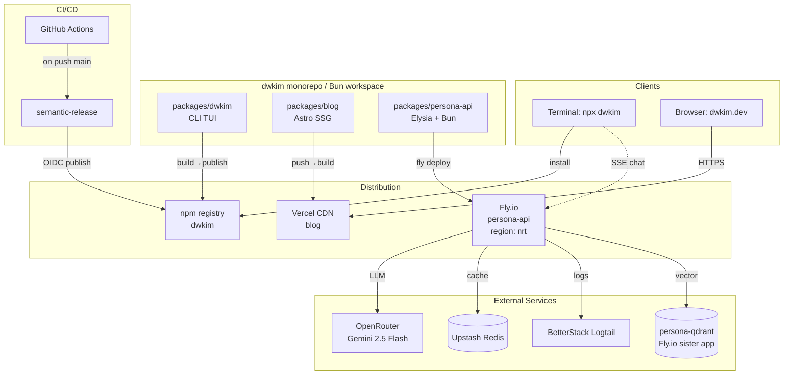
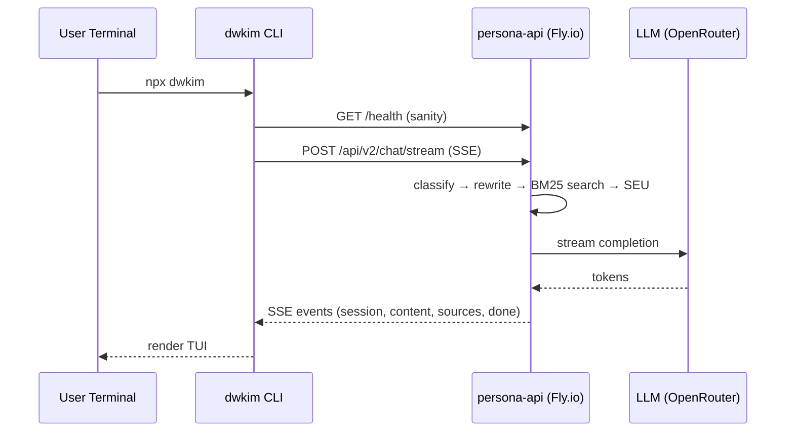

# System Architecture

## System Overview

Bun workspace 모노레포. 3개 독립 배포 아티팩트 (CLI npm 패키지, Astro 정적 사이트, Bun/Elysia API). 공통 GitHub Actions + Biome lint/format.

## Architecture Diagram

## Component Descriptions

### packages/dwkim
- **Purpose**: 터미널 기반 개인 에이전트 CLI
- **Responsibilities**: pi-tui 기반 TUI, state machine, SSE 소비, 이메일/피드백 HITL
- **Dependencies**: `@mariozechner/pi-tui`, `chalk`, `@catppuccin/palette`. 런타임 `persona-api` 필요(DWKIM_API_URL).
- **Type**: Application (npm global CLI)

### packages/persona-api
- **Purpose**: RAG+LLM 페르소나 챗봇 백엔드
- **Responsibilities**: LangGraph 파이프라인 (classify→rewrite→search→analyze→generate→followup), BM25 로컬 인덱스, Redis 대화 히스토리, SEU 불확실성
- **Dependencies**: Elysia, LangChain/LangGraph, OpenRouter, ioredis, pino, Langfuse
- **Type**: Application (Fly.io container)

### packages/blog
- **Purpose**: Astro 5 SSG 블로그
- **Responsibilities**: Cogni SSOT sync → 정적 빌드 → RSS/sitemap/OG 이미지, 포스트 후처리 (mermaid, katex, TOC, 링크 검증)
- **Dependencies**: Astro 5, React 19, mermaid, katex, sharp, Vercel Analytics
- **Type**: Application (Vercel static)

## Data Flow

### T1 — CLI Chat (간략)

## Integration Points

- **External APIs**:
  - OpenRouter (LLM 라우팅, 주: `google/gemini-2.5-flash`)
  - Anthropic/Gemini/OpenAI (직접 호출 옵션)
- **Databases**:
  - Redis (대화 히스토리, 레이트리밋) — 로컬 in-memory fallback
  - Neon Postgres (선택, 벡터 저장용 — init-neon 스크립트)
  - Qdrant (sister Fly app `persona-qdrant`)
- **Third-party Services**:
  - BetterStack (Logtail via pino)
  - Langfuse (LLM observability)
  - Vercel Analytics (블로그)

## Infrastructure Components

- **Fly.io apps**: `persona-api` (nrt, 512mb/shared-cpu, auto-stop/auto-start, min=0)
- **Vercel project**: blog (Astro, `bun install` + `bun run build`)
- **npm registry**: `dwkim` 패키지 (public, OIDC provenance)
- **GitHub Actions**: CI (lint+build on any branch), publish.yml (dwkim 경로 변경 시 semantic-release)
- **Deployment Model**:
  - dwkim/blog = push-to-main 자동 배포
  - persona-api = 수동 `fly deploy`
- **Networking**: Fly HTTPS force, 내부 8080, health /health 30s interval
