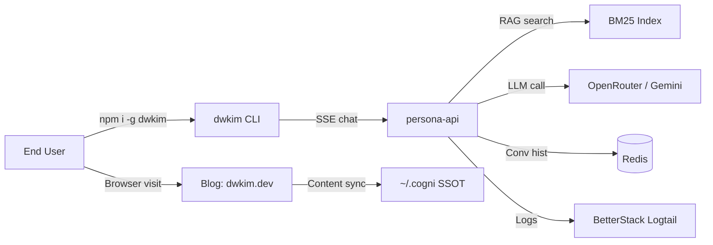

# Business Overview

## Business Context Diagram

## Business Description

- **Business Description**: 김동욱(dwkim) 개인 브랜드·포트폴리오 플랫폼. CLI/블로그/AI 에이전트 3개 접점을 통해 본인 프로필·경력·생각을 대화형으로 전달.
- **Business Transactions**:
  - **T1 — CLI 대화**: 사용자가 `npx dwkim` 실행 → profile 표시 → persona-api 로 SSE 스트리밍 채팅 → 답변/출처/후속질문 수신
  - **T2 — 블로그 열람**: 사용자가 정적 사이트 방문 → 포스트/about 읽기 → RSS/feed 구독
  - **T3 — 콘텐츠 동기화**: 작성자가 Cogni 노트(`~/.cogni`)에 `tags: [blog]` 또는 `tags: [persona]` 작성 → 빌드 시 자동 sync
  - **T4 — 배포**: main 브랜치 push → CLI npm publish (semantic-release) / blog Vercel 자동 배포 / persona-api 수동 `fly deploy`
- **Business Dictionary**:
  - **Persona**: 김동욱에 대한 SSOT 노트 집합 (`tags: [persona]`)
  - **Device ID**: 개인화용 익명 식별자 (`~/.dwkim/device_id`)
  - **SEU**: Semantic Embedding Uncertainty — RAG 응답 불확실성 점수
  - **HITL**: Human-in-the-Loop (이메일 수집/피드백 UI)
  - **A2UI**: Agent-to-UI (추천 질문 버튼)

## Component Level Business Descriptions

### packages/dwkim (CLI)
- **Purpose**: 터미널에서 김동욱과 대화할 수 있는 인터랙티브 TUI
- **Responsibilities**: 프로필 표시, persona-api SSE 소비, 이메일 수집/피드백 UX

### packages/persona-api (Backend)
- **Purpose**: RAG + 개인화 기반 페르소나 챗봇 API
- **Responsibilities**: 쿼리 재작성 → BM25 검색 → SEU 측정 → LLM 생성 → 추천질문. Fly.io 에서 호스팅.

### packages/blog (Static Site)
- **Purpose**: 개인 블로그 (dwkim.dev)
- **Responsibilities**: Astro 빌드, Cogni 노트 sync, RSS/sitemap 생성, Vercel 배포
