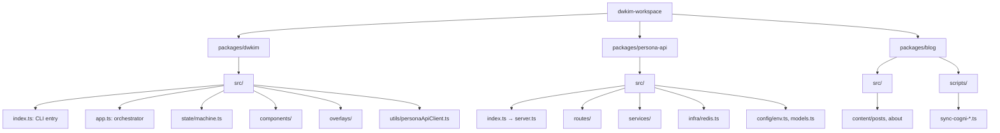

# Code Structure

## Build System
- **Type**: Bun 1.3.10 workspace + esbuild (dwkim) + Astro (blog) + tsc (persona-api)
- **Configuration**:
  - Root: `package.json` (workspaces: `packages/*`), `biome.json`, `bun.lock`, Husky + lint-staged
  - dwkim: `script/build.js` (esbuild, bundle→minify, target node18, ESM)
  - persona-api: `tsc --outDir dist`
  - blog: `astro build` (prebuild: sync-cogni; postbuild: check-links.ts)

## Module Hierarchy



### Existing Files Inventory (배포 관련 중심)

**루트**:
- `package.json` — 워크스페이스 정의, `release:dwkim` 스크립트
- `biome.json` — 린트/포맷 설정
- `.github/workflows/ci.yml` — 모든 브랜치 lint+build
- `.github/workflows/publish.yml` — dwkim 경로 변경 시 semantic-release
- `.github/workflows/claude*.yml` — Claude Code review integrations

**packages/dwkim/**:
- `package.json` — `bin: dwkim`, `files: [dist, scripts/install.sh, package.json]`
- `script/build.js` — esbuild 번들링, `__VERSION__` injection
- `release.config.js` — semantic-release 플러그인 체인 (analyzer → notes → changelog → npm → git → github)
- `src/index.ts` — CLI 진입점, subcommand 라우팅
- `src/utils/personaApiClient.ts` — SSE 스트리밍 클라이언트
- `scripts/install.sh` — 번들 배포용 설치 보조

**packages/persona-api/**:
- `fly.toml` — Fly.io 배포 설정 (nrt, 512mb, auto-stop, health check)
- `Dockerfile` — Bun 공식 이미지, multi-stage (builder→slim)
- `Dockerfile.fly`, `Dockerfile.dev` — 레거시/개발용 변형
- `docker-compose.{yml,dev.yml,prod.yml}` — 로컬 스택 (Redis/Chroma/Ollama)
- `src/index.ts` → `src/server.ts` — Elysia 앱
- `src/config/env.ts` — Zod 기반 env 스키마
- `src/routes/health.ts` — Fly health check 대상
- `scripts/buildSearchIndex.ts` — BM25 인덱스 빌드

**packages/blog/**:
- `vercel.json` — `bun install` + `bun run build`, framework: astro
- `astro.config.mjs` — 플러그인 체인
- `scripts/deploy-blog.sh` — Cogni sync + commit + push (현재 pnpm 명령 사용 — ⚠️ Bun 이행 중 stale)
- `scripts/sync-cogni-{posts,about}.ts` — Cogni SSOT sync
- `scripts/check-links.ts` — postbuild 링크 검증

## Design Patterns

### State Machine (dwkim CLI)
- **Location**: `packages/dwkim/src/state/machine.ts`
- **Purpose**: Pure `transition(state, event) → state`; UI 부수효과 분리
- **Implementation**: Discriminated union (connecting, welcome, idle, loading, emailInput, feedback, exitFeedback, error)

### Singleton Init/Get (persona-api)
- **Location**: `packages/persona-api/src/services/*`
- **Purpose**: 초기화 순서 강제, 런타임 의존성 주입
- **Implementation**:
  ```typescript
  let instance: Service | null = null
  export function initService(deps) { instance = new Service(deps) }
  export function getService() { if (!instance) throw; return instance }
  ```

### LangGraph StateGraph (persona-api)
- **Location**: `packages/persona-api/src/services/personaAgent.ts`
- **Purpose**: 조건부 RAG 파이프라인 분기
- **Implementation**: classify → [simple→directResponse] / [complex→rewrite→search→analyze→generate→followup]

### Multi-Stage Docker Build
- **Location**: `packages/persona-api/Dockerfile`
- **Purpose**: 빌드 아티팩트만 slim 이미지로 복사 (용량↓)

## Critical Dependencies

### `@mariozechner/pi-tui` (dwkim)
- **Version**: ^0.50.3
- **Usage**: TUI 렌더링 (CSI 2026 synchronized output, overlay 시스템)
- **Purpose**: 깜빡임 없는 터미널 UI

### `elysia` + `@elysiajs/*` (persona-api)
- **Version**: ^1.4.22
- **Usage**: HTTP 서버, CORS, bearer auth, swagger
- **Purpose**: Bun 친화 타입드 웹 프레임워크

### `@langchain/langgraph` (persona-api)
- **Version**: ^1.0.0
- **Usage**: RAG 파이프라인 그래프 정의
- **Purpose**: 조건부 실행·스트리밍

### `semantic-release` (dwkim release)
- **Version**: ^25.0.2
- **Usage**: Conventional Commits → 자동 버전/배포
- **Purpose**: 수동 버전 관리 제거
