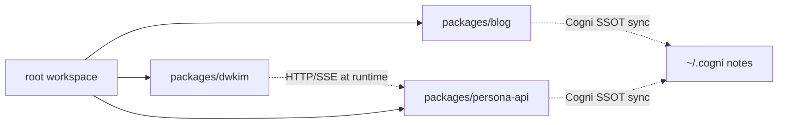

# Dependencies

## Internal Dependencies

### dwkim → persona-api
- **Type**: Runtime (HTTP + SSE)
- **Reason**: CLI 채팅 응답을 API 에서 스트리밍. `DWKIM_API_URL` 환경변수로 전환 가능(기본: https://persona-api.fly.dev)

### blog → Cogni (~/.cogni)
- **Type**: Build-time
- **Reason**: Astro prebuild 시 `tags: [blog]` 노트 sync. `~/.cogni` 미존재 시 스킵 (CI-safe)

### persona-api → Cogni (~/.cogni)
- **Type**: Build-time (선택)
- **Reason**: `build:index` 시 `tags: [persona]` 노트에서 BM25 인덱스 생성
- **Note**: 컨테이너 빌드 시 `~/.cogni` 없으므로 사전 빌드된 `data/` 를 이미지에 포함

### 패키지 간 import: 없음
- 각 패키지는 독립 배포 아티팩트. Bun workspace는 의존성 hoisting용.

## External Dependencies (핵심)

### @langchain/langgraph
- **Version**: ^1.0.0
- **Purpose**: RAG 상태 그래프
- **License**: MIT

### elysia
- **Version**: ^1.4.22
- **Purpose**: Bun 웹 프레임워크
- **License**: MIT

### ai (Vercel AI SDK)
- **Version**: ^6.0.49 (persona-api, blog)
- **Purpose**: Data Stream Protocol, 클라이언트 스트림
- **License**: Apache-2.0

### semantic-release
- **Version**: ^25.0.2
- **Purpose**: Conventional commits 기반 자동 릴리즈
- **License**: MIT

### astro
- **Version**: ^5.11.1
- **Purpose**: SSG
- **License**: MIT

### @mariozechner/pi-tui
- **Version**: ^0.50.3
- **Purpose**: TUI
- **License**: MIT (일반적으로)

## External Services (런타임 의존)

| Service | 용도 | 필수 여부 | 실패 시 동작 |
|---------|------|----------|-------------|
| OpenRouter | LLM 호출 | 필수 | 503 응답 |
| Upstash Redis | 대화/레이트리밋 | 선택 | in-memory fallback |
| Logtail | 로그 | 선택 | pino stdout 만 |
| Langfuse | LLM trace | 선택 | trace 비활성 |
| Qdrant (persona-qdrant) | 벡터 검색 (옵션) | 선택 | BM25 fallback |
| Fly.io 머신 | API 호스팅 | 필수 | 서비스 다운 |
