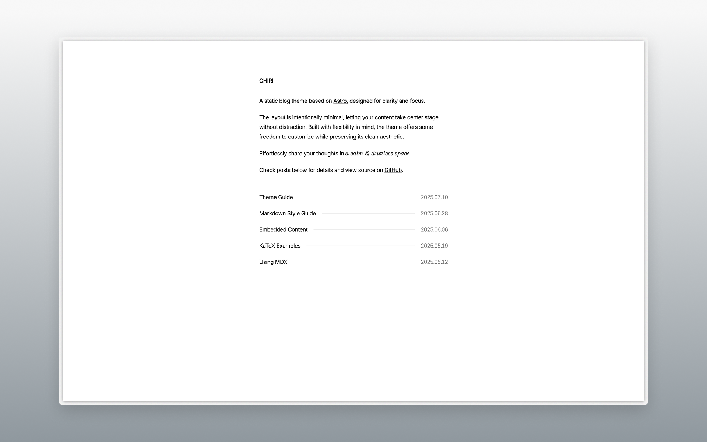
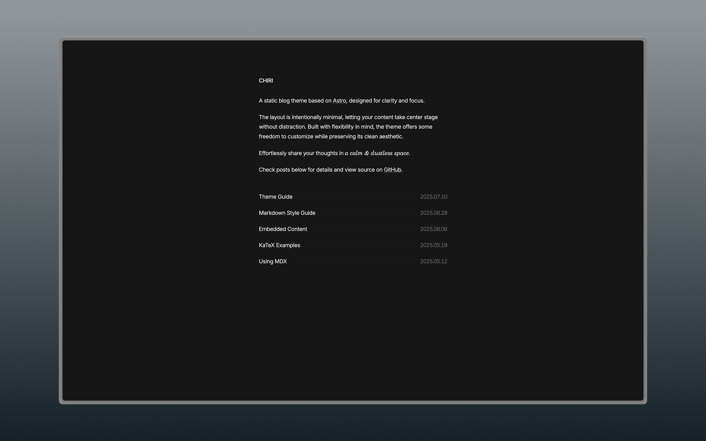

# Chiri 🌸




Chiri is a minimal blog theme built with [Astro](https://astro.build), offering customization options while preserving its clean aesthetic.

Check the [demo](https://astro-chiri.netlify.app/) for more details.

## Features

- Built with Astro
- Responsive
- Light / Dark mode
- MD & MDX
- KaTeX
- Sitemap
- RSS
- ...

## Getting Started

1. [Fork](https://github.com/the3ash/astro-chiri/fork) this repository, or use this template to [create a new repository](https://github.com/new?template_name=astro-chiri&template_owner=the3ash).

2. Run the following commands:

   ```bash
   git clone <your-repo-url>

   cd <your-repo-name>

   pnpm install

   pnpm dev
   ```

3. Edit `src/config.ts` and `src/content/about/about.md` to your liking.

4. Use `pnpm new <title>` to create new posts, or add your posts to `src/content/posts`.

5. Deploy to Netlify, Vercel, or other platforms, refer to [Astro Deployment Guides](https://docs.astro.build/en/guides/deploy/) for more details.

&emsp;[](https://app.netlify.com/start) [](https://vercel.com/new)

## Commands

| Command | Description |
|---------|-------------|
| `pnpm dev` | 개발 서버 실행 |
| `pnpm build` | 정적 사이트 빌드 (sync-cogni 자동 실행) |
| `pnpm sync-cogni` | Cogni 노트 수동 동기화 |
| `pnpm new <title>` | 새 포스트 생성 (`_title`로 draft) |
| `pnpm update-theme` | 테마 최신 버전 업데이트 |

---

## Cogni 통합

블로그 포스트는 `~/.cogni/notes/`에서 관리됩니다 (SSOT).

```
~/.cogni/notes/  →  tags: [blog]  →  pnpm sync-cogni  →  src/content/posts/
```

- `src/content/posts/`에 직접 쓰지 마세요 — sync 시 덮어쓰기됨
- 자세한 내용: [Cogni Integration Architecture](https://github.com/your-repo/cogni/docs/integration-architecture.md)

## References

- https://paco.me/
- https://benji.org/
- https://shud.in/
- https://retypeset.radishzz.cc/

## License

MIT
