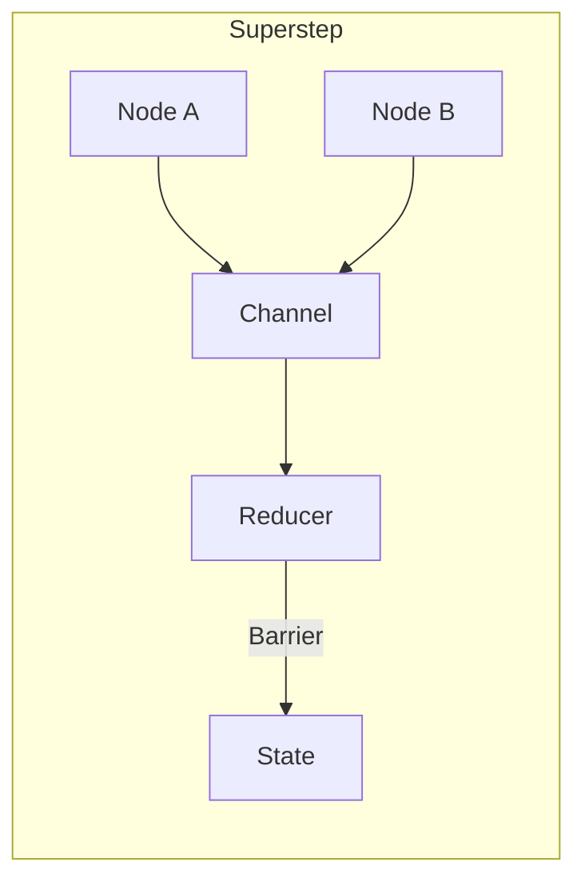

# DeepAgents는 왜 이렇게 생겼을까?

## 주방의 딜레마

> 금요일 저녁 8시. 주문이 20개 밀려있어요. 셰프에겐 5명의 요리사가 있어요.
>
> **첫 번째 시도**: "내가 한 명씩 확인하면서 요리하자."
> → 너무 느렸어요. 손님들이 떠나기 시작했어요.
>
> **두 번째 시도**: "각자 알아서 해."
> → 빨랐지만 엉망이었어요. 스테이크가 나왔는데 소스가 아직 안 됐어요.
>
> **세 번째 시도**: "각자 요리하고, '픽업!' 외치면 그때 맞춰서 내보내자."
> → 완벽하진 않았지만, 돌아갔어요.

이 이야기가 **BSP**의 전부예요.

<div class="callout callout-term">
<div class="callout-title">💡 BSP (Bulk Synchronous Parallel)</div>
<div class="callout-content">
<p>**Bulk**(덩어리) + **Synchronous**(동기화) + **Parallel**(병렬)</p>
<p>"덩어리로 묶어서 동기화하는 병렬 처리"</p>
<p>1990년 하버드의 Leslie Valiant 교수가 제안한 병렬 컴퓨팅 모델이에요<sup>[[1]](#ref-1)</sup>.</p>
</div>
</div>


---

## 코드에서 질문이 생겼어요

LangChain의 DeepAgents 코드를 읽고 있었어요. `Superstep`, `Barrier` 같은 용어가 계속 나왔어요.

> "왜 이렇게 설계했지? 이 용어들은 어디서 온 거야?"

파고들었어요. 그리고 1990년 논문<sup>[[1]](#ref-1)</sup>을 만났어요.

---

## 핵심: Superstep

BSP의 핵심은 **Superstep**이라는 단위예요.

<div class="callout callout-term">
<div class="callout-title">💡 Superstep (슈퍼스텝)</div>
<div class="callout-content">
<p>**Super**(위의, 초월하는) + **Step**(단계)</p>
<p>여러 작은 단계를 묶은 "상위 단계"예요.</p>
<p>주방 비유: "각자 요리 → 픽업!" 이 한 사이클이에요.</p>
</div>
</div>


하나의 Superstep은 세 단계로 이뤄져요:

```
┌─────────────────────────────────────────┐
│            하나의 Superstep              │
├─────────────────────────────────────────┤
│  1. Computation (계산)                   │
│     각자 독립적으로 일해요                │
│                                         │
│  2. Communication (통신)                 │
│     결과물을 보내요 (아직 못 받아요!)      │
│                                         │
│  3. Barrier (동기화)                     │
│     모두 도착할 때까지 기다려요            │
│     ─────────────────────               │
│     → 다음 Superstep에서 메시지를 받아요   │
└─────────────────────────────────────────┘
```

<div class="callout callout-term">
<div class="callout-title">💡 Barrier (배리어)</div>
<div class="callout-content">
<p>**Barrier** = 장벽, 관문</p>
<p>모두가 도착할 때까지 기다리는 동기화 지점이에요.</p>
<p>주방 비유: 셰프가 "픽업!" 외치는 순간. 모든 요리가 준비될 때까지 접시가 안 나가요.</p>
</div>
</div>


**핵심 규칙**:
> Superstep N에서 보낸 메시지는 Superstep N+1에서만 받을 수 있어요.

이 단순한 규칙이 주는 것:
- **데드락 불가능** — 서로 기다리는 순환이 구조적으로 안 생겨요
- **예측 가능** — 같은 입력이면 같은 결과가 나와요

---

## 트레이드오프

| 방식 | 주방 비유 | 장점 | 단점 |
|-----|---------|------|------|
| 완전 동기 | 셰프가 한 접시씩 확인 | 안전해요 | 너무 느려요 |
| 완전 비동기 | 각자 알아서 내보냄 | 빨라요 | 타이밍이 엉망이에요 |
| **BSP** | "픽업!" 신호에 맞춤 | 절충안이에요 | 기다리는 비용이 있어요 |

BSP는 "자주 맞추면 안전하지만 느리고, 드물게 맞추면 빠르지만 위험한" 그 사이 어딘가를 찾아요.

셰프가 "픽업!" 타이밍을 잡는 건, 본능적으로 이 트레이드오프를 최적화한 거예요.

---

## 30년 후: AI 에이전트에서 다시 만났어요

2010년 Google이 그래프 처리에 BSP를 적용했어요<sup>[[2]](#ref-2)</sup>.

그리고 2024년, AI 에이전트 프레임워크에서 다시 만났어요.



<div class="callout callout-term">
<div class="callout-title">💡 Channel (채널)</div>
<div class="callout-content">
<p>**Channel** = 통로, 수로</p>
<p>노드 간 메시지가 흐르는 통로예요.</p>
<p>BSP에서 "메시지 전송"에 해당해요.</p>
</div>
</div>


<div class="callout callout-term">
<div class="callout-title">💡 Reducer (리듀서)</div>
<div class="callout-content">
<p>**Reduce** = 줄이다, 합치다</p>
<p>여러 결과를 하나로 병합하는 함수예요.</p>
<p>BSP의 Barrier에서 일어나는 "상태 통합"이에요.</p>
</div>
</div>


**제가 파악한 매핑**:

| BSP 개념 | LangGraph |
|---------|-----------|
| Processor | Node |
| 메시지 전송 | Channel에 write |
| Barrier | Superstep 경계 |
| 수신 | Reducer가 병합 후 전달 |

DeepAgents에서 여러 도구가 병렬로 실행되고, 결과가 자동으로 병합되는 구조 — 30년 전 Valiant가 설계한 BSP<sup>[[1]](#ref-1)</sup>의 현대판이에요.

---

## 마치며

DeepAgents 코드를 읽다가 시작된 질문이 1990년 논문까지 이어졌어요.

**구현체의 "왜"를 물으면, 결국 기초 아이디어를 만나요.**

BSP는 그중 하나일 뿐이에요. 앞으로 더 파고들 것들:
- **Actor 모델** — Erlang의 기반
- **CSP** — Go의 goroutine/channel

프레임워크는 바뀌어도, 그 뒤의 아이디어는 남아요.

---

## 참고

<span id="ref-1">[1]</span> Leslie Valiant, [*"A Bridging Model for Parallel Computation"*](https://www.semanticscholar.org/paper/A-bridging-model-for-parallel-computation-Valiant/8665c9b459e4161825baf1f25b5141f41a5085ff), Communications of the ACM, 1990

<span id="ref-2">[2]</span> Malewicz et al., [*"Pregel: A System for Large-Scale Graph Processing"*](https://kowshik.github.io/JPregel/pregel_paper.pdf), SIGMOD, 2010

---

## Related

- [[deepagents-스터디]]
- [[moc-ai-agent]]
