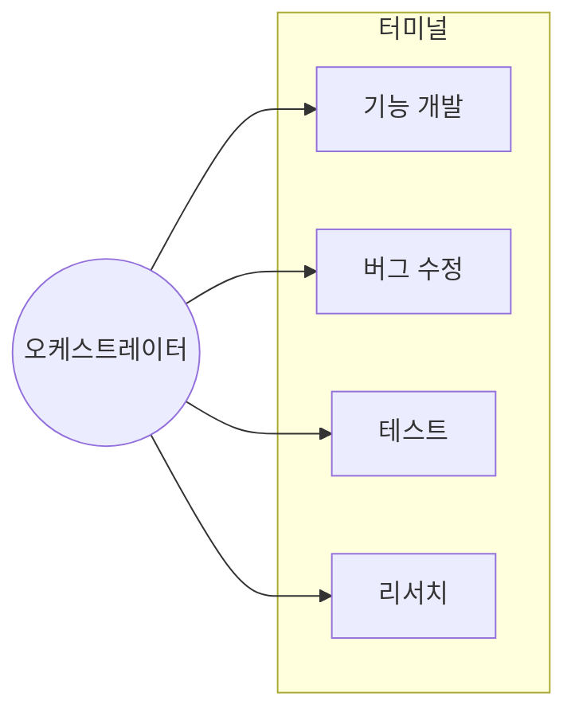

미래의 프로그래머는 코드를 직접 짜는 사람이 아니라, 여러 AI 에이전트와 다면기를 두는 사람이다.

⸻

## 다면기

**다면기(多面棋)**는 한 명의 고수가 여러 명과 동시에 대국하는 형식이다. 판마다 돌아다니며 한 수씩 두고 다음으로 넘어간다. 오래 생각할 여유가 없다. 직관과 패턴 인식에 의존할 수밖에 없다.

터미널 4개를 띄워놓고 클로드 코드와 함께 일하는 것 — 이것이 현대판 다면기다.

다만 역할이 반전된다. 전통적 다면기에서는 고수가 여러 판을 순회했다. 클로드 코드 다면기에서는 에이전트가 고수다. 인간은 여러 판을 조율하는 오케스트레이터가 된다.

⸻

## 왜 작동하는가

이게 되는 이유는 뇌의 작동 방식과 맞닿아 있다.

### 청킹

체스 마스터는 암기를 잘하는 게 아니다. 인식을 잘하는 것이다.

**청킹(Chunking)**은 여러 정보를 하나의 덩어리로 묶는 것이다. 초보자는 개별 요소를 하나씩 처리하다 작업 기억 한계에 도달한다. 전문가는 패턴 단위로 인식해서 적은 청크로 복잡한 상황을 파악한다.

작업 기억은 3-4개 청크로 제한된다. 터미널 4개가 적정 개수인 이유다.

### 인큐베이션

문제에서 잠시 벗어나면, 무의식이 계속 일한다.

**인큐베이션 효과**는 문제를 내려놓았을 때 오히려 해결책이 떠오르는 현상이다. 뇌는 의식적으로 다른 일을 하는 동안에도 이전 문제를 무의식적으로 처리한다. "아하!" 순간은 이 처리의 결과물이다.

T1에서 막히면 T2, T3, T4를 돌아보는 동안 T1에 대한 무의식적 처리가 진행된다.

### 집중과 분산

Barbara Oakley는 뇌에 두 가지 모드가 있다고 말한다. 집중 모드는 분석적이고 순차적이다. 분산 모드는 연상적이고 큰 그림을 본다.

에디슨은 의자에서 졸다가 열쇠가 떨어지면 깨어나곤 했다. 집중에서 분산으로 넘어가는 전환점을 포착하기 위해서다.

한 터미널에 집중하다 다른 터미널로 이동하면 분산 모드에 진입한다. 돌아왔을 때 다르게 보인다.

⸻

## 실전

각 터미널에 명확한 역할을 부여하면 청크 단위로 빠르게 파악할 수 있다. 에이전트가 작업하는 동안 다른 터미널을 확인하면 무의식적 처리 시간을 확보할 수 있다. 막히면 다른 작업으로 전환하는 게 좋다. 분산 모드로 새 연결을 발견할 수 있다.

어려운 문제는 먼저 시작하고, 쉬운 작업을 돌다가 재방문하는 게 좋다.

피해야 할 것도 있다. 한 터미널만 쳐다보며 대기하면 인큐베이션 효과를 잃는다. 5개 이상 터미널은 작업 기억 한계를 넘긴다. 같은 파일을 동시에 수정하면 충돌이 난다.

⸻

## 마무리

다면기 바둑에서 고수가 여러 판을 동시에 두듯이, 클로드 코드 다면기에서 인간은 여러 에이전트와 동시에 협업한다. 뇌가 원래 잘하는 방식으로.
