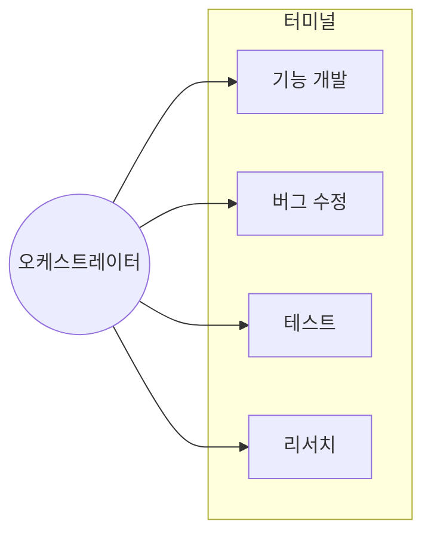

# 클로드 코드와 다면기

터미널 4개를 띄워놓고 클로드 코드와 일하다 보니, 묘하게 몰입이 됐다. 한 터미널에서 막히면 다른 터미널로 옮겨가는 동안 오히려 머리가 맑아졌다.

그런데 문득 궁금해졌다. **왜 이게 잘 되지?**

바둑 다면기가 떠올랐다. 고수가 여러 판을 동시에 돌아다니며 두는 그 방식.

---

## 다면기란?

**다면기(多面棋)**는 한 명의 고수가 여러 명의 상대와 동시에 대국하는 형식이다.

고수는 판마다 돌아다니며 한 수씩 두고 다음 판으로 이동한다. 각 판에서 오래 생각할 여유가 없기에 **직관과 패턴 인식**에 의존한다.

---

## 클로드 코드 다면기

터미널 4개를 띄워놓고 클로드 코드와 함께 일하는 것 — 이것이 현대판 다면기다.

### 역할의 반전

| 전통적 다면기 | 클로드 코드 다면기 |
|--------------|-------------------|
| 고수가 여러 판을 순회 | 인간이 여러 터미널을 순회 |
| 상대가 수를 기다림 | 에이전트가 작업을 수행 |
| 고수 = 실력자 | **에이전트 = 실력자** |
| 상대 = 도전자 | **인간 = 오케스트레이터** |

전통적 다면기에서 고수가 돌아다니며 수를 두었다면, 클로드 코드 다면기에서는 **에이전트가 고수**이고 **인간은 여러 판을 조율하는 오케스트레이터**가 된다.

---

다면기가 효과적이라는 건 느낌으로 안다. 그런데 왜 그럴까?

찾아보니 뇌과학에 답이 있었다.

## 왜 이게 작동하는가?

### 청킹(Chunking): 한눈에 파악하기

> "체스 마스터는 암기를 잘하는 게 아니라, 인식을 잘하는 것이다."

**청킹**은 여러 정보를 하나의 의미 있는 덩어리로 묶는 것이다.

- 초보자: 개별 요소를 하나씩 처리 → 작업 기억 한계 도달
- 전문가: 패턴 단위로 인식 → 적은 청크로 복잡한 상황 파악

작업 기억은 **3-4개 청크**로 제한된다.

물론 정보 청크와 작업 터미널이 1:1로 대응되는 건 아니다. 하지만 핵심은 "한눈에 파악 가능한 범위"다. 터미널이 5개가 되면 어느 것이 어떤 상태인지 헷갈린다. 3개면 여유가 있고, 4개가 긴장감 있는 적정선이었다. (개인차와 작업 복잡도에 따라 다를 수 있다)

**다면기 적용**: 각 터미널에 명확한 역할을 부여하면, "기능 개발 터미널", "버그 수정 터미널"처럼 청크 단위로 빠르게 컨텍스트를 파악할 수 있다.

청킹으로 터미널 4개를 한눈에 파악할 수 있다면, 터미널 사이를 전환하는 그 "사이 시간"은 뭘 할까?

### 인큐베이션: 떠나야 풀린다

> "문제에서 잠시 벗어나면, 무의식이 계속 일한다."

**인큐베이션 효과**는 문제를 내려놓았을 때 오히려 해결책이 떠오르는 현상이다.

뇌는 의식적으로 다른 일을 하는 동안에도 이전 문제를 **무의식적으로 처리**한다. "아하!" 순간은 이 무의식적 처리의 결과물이다.

**다면기 적용**: T1에서 막히면 → T2, T3, T4를 돌아보는 동안 T1에 대한 무의식적 처리가 진행된다.

인큐베이션이 "떠나 있는 동안의 효과"라면, 돌아왔을 때 "다르게 보이는" 현상은 뭘까?

### 집중 모드와 분산 모드

Barbara Oakley의 *Learning How to Learn*에서:

| 집중 모드 (Focused) | 분산 모드 (Diffuse) |
|---------------------|---------------------|
| 전전두엽 피질 활성화 | DMN(기본 모드 네트워크) 활성화 |
| 분석적, 순차적 사고 | 연상적, 큰 그림 사고 |
| 알고 있는 패턴 적용 | 새로운 연결 발견 |

에디슨은 의자에서 졸다가 열쇠가 떨어지면 깨어나곤 했다 — 집중↔분산 전환점을 포착하기 위해서.

**다면기 적용**: 한 터미널에 집중 → 다른 터미널로 이동 → 자연스럽게 분산 모드 진입. 돌아왔을 때 신선한 시각으로 재접근.

---

## 실전 전략

### DO ✓

| 전략 | 뇌과학적 근거 |
|------|--------------|
| 각 터미널에 명확한 역할 부여 | 청킹 — 빠른 컨텍스트 파악 |
| 에이전트 작업 중 다른 터미널 확인 | 인큐베이션 — 무의식적 처리 시간 |
| 막히면 다른 작업으로 전환 | 분산 모드 — 새 연결 발견 |
| 완료된 작업 즉시 리뷰 | 집중 모드 — 분석적 검토 |

### DON'T ✗

| 피해야 할 것 | 이유 |
|-------------|------|
| 한 터미널만 쳐다보며 대기 | 인큐베이션 효과 상실 |
| 5개 이상 터미널 | 작업 기억 한계 초과 |
| 같은 파일 동시 수정 | 충돌과 혼란 |

---

## 마무리

처음에는 그냥 "효율적이다"고만 느꼈다. 왜인지 몰랐다.

찾아보니 답이 있었다. 청킹, 인큐베이션, 분산 모드. 뇌가 원래 잘하는 방식으로 일하고 있었던 거다.

AI는 단순한 도구가 아니라, 인간 뇌의 자연스러운 작동 방식을 활용하게 해주는 **인지 확장 도구**다.

다면기 바둑에서 고수가 여러 판을 동시에 두듯이, 클로드 코드 다면기에서 인간은 여러 에이전트와 동시에 협업하며 — 자신의 뇌가 가장 잘 작동하는 방식으로 일한다.

> **미래의 프로그래머는 코드를 직접 짜는 사람이 아니라, 여러 AI 에이전트와 다면기를 두는 사람이다.**
