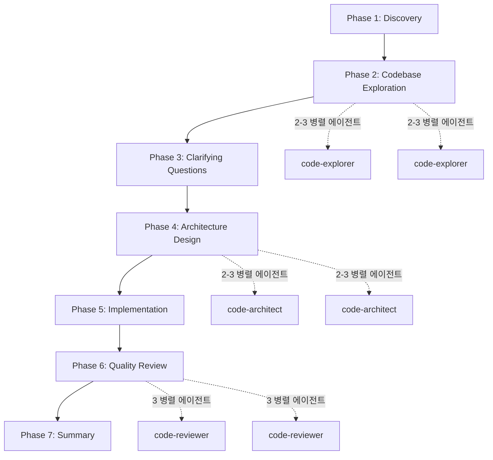

# Anthropic 개발자들은 이렇게 플러그인을 만든다

> Claude Code 공식 플러그인 소스코드를 파헤쳐보니, 생각보다 훨씬 체계적이었다.

## TL;DR

- Anthropic은 **13개 공식 플러그인**을 오픈소스로 공개했다
- 핵심 패턴: **병렬 에이전트**, **신뢰도 기반 필터링**, **7-phase 워크플로우**
- 단순 사용법이 아닌, 실제 코드와 설계 의도를 분석해본다

---

## 1. 왜 공식 플러그인을 분석해야 하는가?

요리를 배울 때 레시피만 읽는 것과 셰프의 주방에서 직접 보는 것은 다르다. 플러그인도 마찬가지다.

대부분의 Claude Code 플러그인 가이드는 "어떻게 만드는지"만 알려준다. 하지만 진짜 배움은 **잘 만든 코드를 읽을 때** 온다. 문서는 "무엇"을 알려주지만, 소스코드는 "왜"를 보여준다.

Anthropic 팀이 직접 만든 플러그인들:
- `feature-dev` - 7단계 기능 개발 워크플로우
- `code-review` - 병렬 에이전트 기반 PR 리뷰
- `pr-review-toolkit` - 6종 전문 에이전트
- `code-simplifier` - 코드 단순화 전문가

이들의 공통점? **"그냥 프롬프트"가 아니라 설계된 시스템**이라는 것. 단순히 "코드 리뷰해줘"라고 쓴 게 아니다. 언제, 어떤 순서로, 무엇을 검토할지가 정교하게 설계되어 있다.

그렇다면 구체적으로 어떻게 설계되어 있을까? 가장 단순한 `code-review`부터 시작해서 복잡한 `feature-dev`까지 단계적으로 살펴보자.

---

## 2. code-review: 병렬 에이전트 + 신뢰도 필터링

### 구조
```
plugins/code-review/
├── .claude-plugin/plugin.json
├── commands/code-review.md      ← PR 리뷰 오케스트레이터
└── agents/
    └── (4개 병렬 에이전트 내장)
```

### 8단계 리뷰 프로세스

1. **사전 검사** - PR이 닫혔거나 draft인지 확인
2. **파일 탐색** - 변경된 디렉토리의 CLAUDE.md 파일 식별
3. **PR 요약** - 변경 사항 요약 에이전트 실행
4. **병렬 리뷰** - 4개 에이전트가 동시에 검토
5. **고신뢰 이슈만 추출** - 80%+ threshold
6. **검증** - 플래그된 이슈에 대해 subagent 재검증
7. **필터링** - false positive 제거
8. **코멘트 작성** - GitHub inline comment

### 핵심 인사이트

8단계나 되는 프로세스다. 왜 이렇게까지 해야 할까? 단순히 "코드 리뷰해줘"라고 하면 안 되는 걸까?

문제는 **노이즈**다. AI 리뷰어가 모든 것을 지적하면, 정작 중요한 버그가 사소한 스타일 피드백에 묻힌다. code-review는 이 문제를 세 가지 방법으로 해결한다.

**1) 4개 병렬 리뷰 에이전트**

한 사람이 보안, 성능, 컨벤션, 로직을 모두 꼼꼼히 보기 어렵다. 전문가 네 명이 각자 맡은 영역만 집중하면?

| 에이전트 | 역할 |
|----------|------|
| Compliance Agent 1 | CLAUDE.md 규칙 준수 검사 |
| Compliance Agent 2 | 코딩 컨벤션 검사 |
| Bug Detector | 버그, 로직 오류 탐지 |
| History Analyzer | PR 히스토리 기반 분석 |

**2) 신뢰도 기반 필터링**

병렬로 분석하면 발견량은 늘어난다. 하지만 동시에 오탐도 늘어난다. 어떻게 구분할까?

```markdown
High-signal issues only:
- 컴파일 에러
- 로직 오류
- 명확한 CLAUDE.md 위반

스타일 이슈는 무시한다.
```

80% 이상 확신이 있는 이슈만 리포트. "혹시 모르니까 말해둘게요" 같은 노이즈 제거.

**3) 재검증 단계**

그런데 80% 확신이라고 해서 다 맞을까? 컨텍스트를 놓쳤을 수도 있다. 그래서 한 번 더 검증한다.

플래그된 이슈마다 **별도 subagent**가 다시 검증:
- 정말 버그인가?
- Context를 고려했을 때도 문제인가?

False positive를 극적으로 줄이는 핵심 패턴. 마치 의사가 1차 진단 후 전문의에게 확인받는 것과 같다.

code-review는 **하나의 작업**(PR 리뷰)에 집중한다. 그렇다면 여러 작업을 순차적으로 조율해야 하는 경우는 어떨까? 이제 더 복잡한 feature-dev를 살펴보자.

---

## 3. feature-dev: 7-Phase 워크플로우의 비밀

### 구조
```
plugins/feature-dev/
├── .claude-plugin/plugin.json
├── commands/feature-dev.md      ← 오케스트레이터
└── agents/
    ├── code-explorer.md         ← 탐색 전문가
    ├── code-architect.md        ← 설계 전문가
    └── code-reviewer.md         ← 리뷰 전문가
```

### 7단계 워크플로우



### 핵심 인사이트

code-review가 하나의 작업에 병렬 에이전트를 적용했다면, feature-dev는 **여러 작업을 순차적으로** 조율한다. 여기엔 세 가지 추가 설계 원칙이 있다.

**1) 단계별 병렬 에이전트**

code-review처럼 한 번만 병렬로 도는 게 아니다. **각 단계마다** 병렬 에이전트를 실행한다.

Phase 2에서 2-3개의 `code-explorer` 에이전트를 **동시에** 실행:
- Agent 1: 유사 기능 추적
- Agent 2: 아키텍처 매핑
- Agent 3: UI 패턴 분석

각 에이전트는 **5-10개 핵심 파일**을 식별해야 한다. 결과를 합치면 15-30개 파일의 종합적인 맵이 완성된다.

**2) 명시적 승인 게이트**

병렬로 정보를 모았다면, 이제 결정을 내려야 한다. code-review는 최종 결과만 보여주지만, feature-dev는 **중간중간 사용자 승인**을 받는다.

```markdown
Phase 4: Architecture Design
→ 여러 접근법 제시 (최소 변경 vs 클린 아키텍처 vs 실용적 균형)
→ "wait for answers before proceeding"
→ 사용자 승인 후에만 구현 시작
```

**3) Command가 Agent를 오케스트레이션**

그렇다면 이 모든 것을 누가 조율하는가?

`feature-dev.md`는 슬래시 커맨드로, 내부에서 여러 에이전트를 순차/병렬 호출한다. Hook이 아니라 **프롬프트 기반 오케스트레이션**. 마치 지휘자가 악보를 보고 각 파트에 신호를 주듯, Command가 전체 흐름을 제어한다.

---

## 4. 배울 점: 내 플러그인에 적용하기

지금까지 code-review(단일 작업)와 feature-dev(다단계 워크플로우)를 분석했다. 단순한 것에서 복잡한 것으로. 이제 이 패턴들을 우리 플러그인에 어떻게 적용할 수 있을까?

### Pattern 1: 병렬 에이전트로 다양한 관점

```yaml
# 나쁜 예: 단일 에이전트
Launch one agent to review everything

# 좋은 예: 병렬 에이전트
Launch 3 agents simultaneously:
- Agent 1: Focus on security
- Agent 2: Focus on performance
- Agent 3: Focus on maintainability
```

### Pattern 2: 신뢰도 기반 필터링

병렬로 많은 정보를 모았다면, 이제 **무엇을 말하지 않을지**가 중요해진다.

```markdown
Only report issues with 80%+ confidence.
Do NOT report:
- Style preferences
- "Maybe" concerns
- Low-impact suggestions
```

### Pattern 3: 명시적 승인 게이트

정보를 모으고 필터링했다면, 이제 **결정권을 사용자에게** 돌려줘야 한다.

```markdown
After presenting options:
"Wait for user approval before proceeding to implementation"
```

자율성과 통제의 균형. AI가 모든 것을 할 수 있지만, 중요한 결정에서는 사람이 선택한다.

### Pattern 4: Command → Agent 오케스트레이션

마지막으로, 이 모든 것을 **어떻게 엮을 것인가**.

Hook이 아닌 **프롬프트로 체이닝**:
```markdown
## Phase 1
Do X

## Phase 2
Launch agent-a and agent-b in parallel
Wait for completion

## Phase 3
Based on results, proceed to...
```

---

## 5. 결론

처음 질문으로 돌아가보자. Anthropic 개발자들은 플러그인을 어떻게 만들었나?

"그냥 프롬프트"가 아니었다. **체계적으로 설계된 워크플로우 시스템**이었다.

핵심 원칙:

1. **단일 에이전트보다 병렬 에이전트** - 다양한 관점, 빠른 실행
2. **노이즈 필터링** - 신뢰도 기반, 재검증으로 품질 확보
3. **프롬프트 기반 오케스트레이션** - Hook보다 유연한 워크플로우 설계
4. **명시적 게이트** - 사용자 확인 없이 진행하지 않음

이번 글에서는 "어떻게" 설계되었는지를 봤다. 하지만 아직 답하지 못한 질문이 있다. Command, Agent, Skill, Hook... 도대체 **언제 뭘 써야 하는 걸까?**

다음 글에서 이 질문에 답한다.

---

## References

- [anthropics/claude-code/plugins](https://github.com/anthropics/claude-code/tree/main/plugins)
- [anthropics/claude-plugins-official](https://github.com/anthropics/claude-plugins-official)
- [Claude Code Docs - Plugins](https://code.claude.com/docs/en/plugins)
