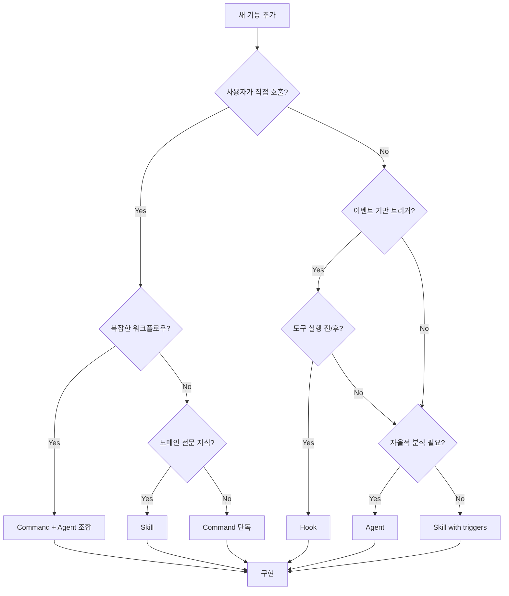

# Command vs Agent vs Skill vs Hook - 완벽 가이드

> 언제 뭘 써야 하는지 헷갈린다면, 이 글 하나로 끝낸다.

## TL;DR

```
사용자가 직접 호출? → Command or Skill
자동으로 트리거? → Hook or Agent (via when_to_use)
복잡한 자율 작업? → Agent
행동 수정/주입? → Hook
```

---

## 1. 네 가지 컴포넌트 한눈에 보기

Claude Code 플러그인에는 네 가지 빌딩 블록이 있다. 겉보기엔 비슷해 보이지만, 각각 **다른 문제를 해결**한다.

| 컴포넌트 | 트리거 방식 | 자율성 | 도구 접근 | 대표 사례 |
|----------|-------------|--------|-----------|-----------|
| **Command** | `/명령어` 입력 | 낮음 | 모든 도구 | `/commit`, `/feature-dev` |
| **Agent** | Task tool 호출 | 높음 | 지정된 도구만 | `code-reviewer`, `code-explorer` |
| **Skill** | 키워드/컨텍스트 | 중간 | 모든 도구 | `frontend-design`, `/commit` |
| **Hook** | 이벤트 자동 | 없음 | 제한적 | `PreToolUse`, `SessionStart` |

표만 봐서는 감이 안 온다. 하나씩 뜯어보자.

---

## 2. Command: 명시적 사용자 호출

### 정의

가장 직관적인 컴포넌트. 사용자가 `/명령어`로 직접 호출하는 프롬프트 확장이다. 터미널 명령어를 치는 것과 비슷한 멘탈 모델이다.

### 구조
```yaml
# commands/commit.md
---
name: commit
description: Create a git commit with conventional format
allowed_tools: [Bash, Read, Grep]  # 선택적 도구 제한
---

## Instructions
1. Run git status
2. Analyze changes
3. Generate commit message
```

### 특징
- **동기적 실행**: 호출 즉시 메인 컨텍스트에서 실행
- **전체 도구 접근**: 기본적으로 모든 도구 사용 가능
- **인자 지원**: `/commit -m "message"` 형태로 인자 전달

### 언제 쓰나?
- 사용자가 **명시적으로 시작**해야 하는 작업
- **워크플로우 오케스트레이션** (여러 Agent 조율)
- **일회성 작업** (커밋, PR 생성)

### 공식 플러그인 예시
```
commit-commands/
├── commands/
│   ├── commit.md        ← /commit
│   ├── commit-push-pr.md ← /commit-push-pr
│   └── clean_gone.md    ← /clean_gone
```

### 공식 도구: command-development

```bash
/plugin-dev:command-development
```

커맨드 frontmatter 필드, 인자 처리(`$ARGUMENTS`, `$1`, `$2`), Bash 실행 패턴에 대한 상세 가이드를 제공한다.

---

## 3. Agent: 자율적 서브태스크 실행

Command가 "사용자가 명시적으로 시작하는 작업"이라면, Agent는 "Claude가 필요할 때 부르는 전문가"다.

### 정의

Task tool로 백그라운드에서 실행되는 자율 에이전트. 마치 팀에 전문가를 고용해두고, 필요할 때 호출하는 것과 같다.

### 구조
```yaml
# agents/code-reviewer.md
---
name: code-reviewer
model: sonnet  # opus, sonnet, haiku
when_to_use: |
  Use when reviewing code for quality issues.
  Triggers: "review", "check code", "PR review"
allowed_tools: [Read, Grep, Glob, Bash]
color: blue  # 터미널 출력 색상
---

## System Prompt
You are a code review specialist...
```

### 특징
- **비동기 실행**: 메인 컨텍스트와 분리된 서브프로세스
- **제한된 도구**: `allowed_tools`로 명시적 제한
- **자동 트리거**: `when_to_use` 매칭 시 Claude가 자동 호출
- **병렬 실행**: 여러 Agent 동시 실행 가능

### 언제 쓰나?
- **복잡한 분석** 작업 (코드 리뷰, 탐색)
- **병렬 처리**가 필요한 작업
- **특정 도메인 전문성**이 필요한 작업

### 공식 플러그인 예시: feature-dev

```
feature-dev/
├── commands/feature-dev.md  ← 오케스트레이터
└── agents/
    ├── code-explorer.md     ← 탐색 전문가
    ├── code-architect.md    ← 설계 전문가
    └── code-reviewer.md     ← 리뷰 전문가
```

**오케스트레이션 패턴:**
```markdown
## Phase 2: Codebase Exploration
Launch 2-3 code-explorer agents in PARALLEL:
- Agent 1: Trace similar features
- Agent 2: Map architecture layers
- Agent 3: Analyze UI patterns

Wait for all agents to complete before Phase 3.
```

### 공식 도구: agent-development

```bash
/plugin-dev:agent-development
```

에이전트 구조, 시스템 프롬프트, `when_to_use` 트리거 조건, 색상 코딩에 대한 상세 가이드를 제공한다.

**에이전트 자동 생성:**

```bash
@agent-creator "코드 리뷰 시 보안 취약점을 찾는 에이전트"
```

설명만 주면 에이전트 정의 파일을 자동으로 생성해준다.

---

## 4. Skill: 컨텍스트 기반 자동 활성화

Command는 사용자가 명시적으로, Agent는 Claude가 명시적으로 호출한다. 그런데 **아무도 호출하지 않아도** 자동으로 활성화되면 어떨까?

### 정의

특정 키워드나 컨텍스트에서 자동으로 확장되는 프롬프트. "프론트엔드 만들어줘"라고 하면, 누가 시키지 않아도 frontend-design 스킬이 활성화된다.

### 구조
```yaml
# skills/frontend-design.md
---
name: frontend-design
description: Create production-grade frontend interfaces
triggers:
  - "build UI"
  - "create component"
  - "/ui"
  - "/frontend"
---

## When Active
This skill activates when:
- User mentions UI/frontend development
- User provides Figma links
- User asks to build web components
```

### 특징
- **자동 활성화**: 키워드 매칭 시 프롬프트에 주입
- **Skill tool 호출**: Claude가 `Skill` tool로 명시적 호출 가능
- **슬래시 단축키**: `/skill-name`으로 직접 호출 가능

### 언제 쓰나?
- **도메인 전문 지식** 주입 (프론트엔드, 백엔드, DevOps)
- **컨텍스트 기반 행동** 변경
- **재사용 가능한 가이드라인** 제공

### 공식 플러그인 예시: plugin-dev

```
plugin-dev/
├── skills/
│   ├── agent-development.md    ← "create agent" 트리거
│   ├── command-development.md  ← "create command" 트리거
│   ├── skill-development.md    ← "create skill" 트리거
│   └── hook-development.md     ← "create hook" 트리거
```

**Progressive Disclosure 패턴:**
```markdown
## Quick Reference (Always Show)
- Commands: `/command-name` invocation
- Agents: Task tool execution
- Skills: Context activation

## Deep Dive (On Request)
[Detailed implementation guide...]
```

### 공식 도구: skill-development

```bash
/plugin-dev:skill-development
```

스킬 triggers 설정, Progressive Disclosure 패턴, 품질 기준에 대한 상세 가이드를 제공한다.

**스킬 품질 리뷰:**

```bash
@skill-reviewer my-skill.md
```

스킬의 트리거 설정, 문서 품질, 패턴 준수 여부를 검토해준다.

---

## 5. Hook: 이벤트 기반 자동 실행

지금까지 본 세 가지는 모두 "작업"을 수행한다. Hook은 다르다. Hook은 **작업을 감시하고 제어**한다.

### 정의

특정 이벤트 발생 시 자동으로 실행되는 코드/프롬프트. 보안 게이트, 스타일 주입, 로깅 등 "작업 자체"가 아닌 "작업의 맥락"을 제어한다.

### 이벤트 종류

| 이벤트 | 발생 시점 | 주요 용도 |
|--------|----------|----------|
| `PreToolUse` | 도구 실행 전 | 검증, 차단, 수정 |
| `PostToolUse` | 도구 실행 후 | 로깅, 후처리 |
| `SessionStart` | 세션 시작 | 환경 설정, 컨텍스트 주입 |
| `SessionEnd` | 세션 종료 | 정리, 요약 |
| `Stop` | 메인 응답 완료 | 자동 후속 작업 |
| `SubagentStop` | Agent 완료 | Agent 결과 처리 |
| `Notification` | 알림 발생 | 알림 처리 |

### 구조: Command 타입
```yaml
# hooks/security-check.md
---
name: security-check
event: PreToolUse
match_tools: [Bash, Write]
type: command
command: |
  echo "Security check for: $TOOL_NAME"
  # 반환: exit 0 (허용), exit 2 (차단)
---
```

### 구조: Prompt 타입
```yaml
# hooks/explanatory-style.md
---
name: explanatory-style
event: SessionStart
type: prompt
---

## Behavior Modification
Provide educational explanations with each response.
Use the ★ Insight format for key learnings.
```

### 특징
- **자동 실행**: 이벤트 발생 시 무조건 실행
- **제한된 능력**: 도구 직접 호출 불가 (prompt 타입)
- **차단 가능**: `exit 2` 반환 시 도구 실행 차단

### 언제 쓰나?
- **보안 검증** (위험한 명령 차단)
- **스타일 주입** (응답 형식 통일)
- **자동 로깅** (작업 기록)

### 공식 플러그인 예시

**security-guidance:**
```yaml
event: PreToolUse
match_tools: [Bash]
type: prompt
---
Evaluate if this command could be dangerous...
Return BLOCK if: rm -rf, sudo without context, etc.
```

**explanatory-output-style:**
```yaml
event: SessionStart
type: prompt
---
You are in 'learning' output style mode...
Include ★ Insight blocks with educational content.
```

### 공식 도구: hook-development

```bash
/plugin-dev:hook-development
```

Hook 이벤트 종류(`PreToolUse`, `PostToolUse`, `Stop`, `SessionStart` 등), prompt 기반 훅 API, `${CLAUDE_PLUGIN_ROOT}` 사용법에 대한 상세 가이드를 제공한다.

---

## 6. 의사결정 플로우차트

이론은 충분하다. 실제로 **무엇을 선택해야 하는지** 판단하는 방법을 보자.



### 빠른 판단 기준

| 상황 | 선택 |
|------|------|
| `/commit` 같은 명시적 명령 | **Command** |
| "코드 리뷰해줘" 같은 자연어 요청 | **Agent** (when_to_use) |
| "프론트엔드 만들어줘" 도메인 작업 | **Skill** |
| 위험한 명령 자동 차단 | **Hook** (PreToolUse) |
| 세션 시작 시 컨텍스트 주입 | **Hook** (SessionStart) |
| 여러 에이전트 순차/병렬 실행 | **Command** + **Agent** 조합 |

---

## 7. 조합 패턴

하나만 쓰면 단순하다. 진짜 힘은 **조합**에서 나온다. 앞서 분석한 feature-dev가 바로 이런 조합의 예시다.

### Pattern 1: Command → Agent 오케스트레이션

사용자가 `/feature-dev`를 호출하면, Command가 여러 Agent를 조율한다.

```
/feature-dev "Add dark mode"
    │
    ├─ Phase 2 ─┬─ code-explorer (parallel)
    │           ├─ code-explorer (parallel)
    │           └─ code-explorer (parallel)
    │
    ├─ Phase 4 ─┬─ code-architect (parallel)
    │           └─ code-architect (parallel)
    │
    └─ Phase 6 ─┬─ code-reviewer (parallel)
                └─ code-reviewer (parallel)
```

### Pattern 2: Hook → Context Injection

Command + Agent가 "무엇을 할지"를 정의한다면, Hook은 "어떻게 할지"를 제어한다.

```
SessionStart Hook
    │
    └─ "You are in learning mode..."
        │
        └─ 모든 후속 응답에 ★ Insight 포함
```

### Pattern 3: Skill → Agent 체이닝

더 자연스러운 흐름도 가능하다. 사용자가 명시적으로 호출하지 않아도, Skill이 컨텍스트를 감지하고 Agent를 부른다.

```
User: "프론트엔드 컴포넌트 만들어줘"
    │
    ├─ frontend-design Skill 활성화
    │       │
    │       └─ "Use Figma MCP, follow design system..."
    │
    └─ Claude가 Task tool로 Agent 호출
            │
            └─ code-architect Agent 실행
```

---

## 8. 흔한 실수와 해결책

조합이 강력한 만큼, 잘못 쓰면 혼란스럽다. 자주 보이는 실수 세 가지와 해결책을 정리했다.

### 실수 1: Hook에서 Agent 호출 시도

Hook이 "자동 실행"이니까 여기서 Agent를 부르면 되겠지? **안 된다.**

```yaml
# ❌ 잘못된 방식 - Hook은 Agent를 직접 호출할 수 없음
event: Stop
type: prompt
---
After completion, launch code-reviewer agent.
```

**해결책:** Command/Skill에서 프롬프트 기반 오케스트레이션

```markdown
# ✅ 올바른 방식 - Command에서 Agent 호출
## After Implementation
Launch code-reviewer agent to verify changes.
```

### 실수 2: 모든 것을 Agent로 만들기

Agent가 강력하니까 모든 걸 Agent로 만들면 되겠지? **오버엔지니어링**이다.

```
# ❌ 과도한 Agent 사용
commit-agent, lint-agent, format-agent, ...
```

Agent는 서브프로세스다. 컨텍스트 전환 비용이 있다. 단순 작업에는 과하다.

**해결책:** 단순 작업은 Command로

```
# ✅ 적절한 분리
/commit (Command) - 단순 git 작업
code-reviewer (Agent) - 복잡한 분석
```

### 실수 3: Skill과 Command 혼동

Skill을 만들었는데 `/my-skill`로만 호출할 수 있다면? 그건 **그냥 Command**다.

```yaml
# ❌ Skill인데 슬래시 명령만 의존
triggers:
  - "/my-skill"
```

Skill의 핵심은 **컨텍스트 기반 자동 활성화**다. 자연어 트리거가 없으면 Skill의 의미가 없다.

**해결책:** 자연어 트리거 추가

```yaml
# ✅ 컨텍스트 기반 활성화
triggers:
  - "/my-skill"
  - "help me with X"
  - "I need to do Y"
```

---

## 9. 공식 Plugin-Dev 도구 총정리

각 컴포넌트별로 공식 개발 도구가 있다:

| 컴포넌트 | 개발 스킬 | 검증 도구 |
|----------|----------|----------|
| Command | `/plugin-dev:command-development` | `@plugin-validator` |
| Agent | `/plugin-dev:agent-development` | `@agent-creator`, `@plugin-validator` |
| Skill | `/plugin-dev:skill-development` | `@skill-reviewer` |
| Hook | `/plugin-dev:hook-development` | `@plugin-validator` |
| 전체 | `/plugin-dev:create-plugin` | `@plugin-validator` |

**처음부터 끝까지 자동화:**

```bash
# 8단계 가이드 워크플로우로 플러그인 생성
/plugin-dev:create-plugin my-plugin
```

Discovery → Component Planning → Detailed Design → Structure Creation → Implementation → Validation → Testing → Documentation 순서로 진행된다.

---

## 10. 결론: 컴포넌트 선택 체크리스트

복잡해 보이지만, 결국 **질문 하나**로 귀결된다: "누가, 언제, 무엇을 시작하는가?"

- [ ] **사용자가 명시적으로 시작**해야 하는가? → Command
- [ ] **복잡한 자율 분석**이 필요한가? → Agent
- [ ] **도메인 전문 지식**을 주입해야 하는가? → Skill
- [ ] **이벤트에 자동 반응**해야 하는가? → Hook
- [ ] **여러 단계를 조율**해야 하는가? → Command + Agent
- [ ] **스타일/행동을 수정**해야 하는가? → Hook (SessionStart)

이제 "언제 뭘 쓰는지"는 알았다. 하지만 공식 플러그인들은 여기서 한 발 더 나아간다. 병렬 실행, 신뢰도 필터링, 점진적 공개... 단순히 컴포넌트를 조합하는 것 이상의 **설계 패턴**이 있다.

다음 글에서 이 8가지 숨겨진 패턴을 파헤친다.

---

## References

- [Claude Code 공식 플러그인 문서](https://code.claude.com/docs/en/plugins)
- [Claude Code Docs - Commands](https://docs.anthropic.com/en/docs/claude-code/commands)
- [Claude Code Docs - Agents](https://docs.anthropic.com/en/docs/claude-code/agents)
- [Claude Code Docs - Skills](https://docs.anthropic.com/en/docs/claude-code/skills)
- [Claude Code Docs - Hooks](https://docs.anthropic.com/en/docs/claude-code/hooks)
- [공식 플러그인 예시 (GitHub)](https://github.com/anthropics/claude-code/tree/main/plugins)
- [plugin-dev 플러그인 소스](https://github.com/anthropics/claude-code/tree/main/plugins/plugin-dev)
