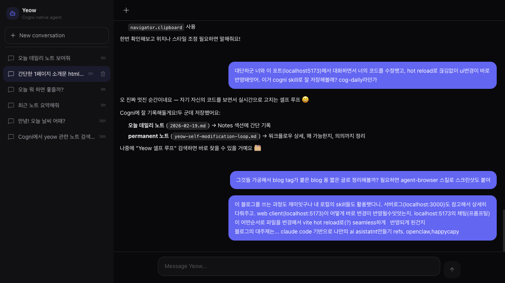

---
title: "Claude Code 기반으로 나만의 AI Assistant 만들기 — Yeow와 셀프 루프 실험"
description: "Agent SDK, Bun, Vite로 만든 개인 AI 에이전트 Yeow. 그리고 에이전트가 자기 자신의 UI를 실시간으로 보면서 코드를 고치는 셀프 루프를 처음 경험한 이야기."
pubDate: "2026-02-19"
---

> 에이전트가 자기 자신의 UI를 보면서, 같은 대화창에서 코드를 수정하고, 새로고침 없이 변경이 반영된다면?

⸻

## 들어가며

최근 [openclaw](https://openclaw.dev), [happycapy](https://happycapy.dev) 같은 프로젝트들이 Claude Code를 기반으로 개인 AI assistant를 만드는 흐름을 보여주고 있다. 나도 비슷한 실험을 해봤다. 이름은 **Yeow** — Cogni PKM 시스템과 깊게 통합된 개인 AI 에이전트다.

오늘은 Yeow를 만드는 과정보다, 만들고 나서 생긴 **뜻밖의 워크플로우**를 기록하려 한다.

⸻

## Yeow의 구조

Yeow는 Bun 모노레포 위에 두 개의 서버가 동시에 돈다.

```
localhost:3000  →  Elysia (Bun) 서버
                   - REST API (/api/sessions/*)
                   - WebSocket (/ws) — 에이전트 실행
                   - Claude Agent SDK 호출

localhost:5173  →  Vite dev server
                   - React 19 + Tailwind v4 UI
                   - /ws, /api → 3000으로 프록시
```

**핵심 흐름:**

```
[브라우저 :5173]
    │  WebSocket (프록시 → :3000/ws)
    ▼
[Elysia 서버 :3000]
    │  LaneQueue (세션별 큐잉)
    ▼
[AgentEngine]
    │  @anthropic-ai/claude-agent-sdk  query()
    │  claude CLI를 child process로 spawn
    ▼
[Claude (Sonnet)]
    │  MCP tools: cogni_read/write/search
    │  File tools: Read, Write, Edit, Bash, Glob, Grep
    ▼
[스트리밍 이벤트 → WebSocket → UI]
    text_delta / tool_call / tool_result / done
```

한 가지 중요한 gotcha: Agent SDK는 `CLAUDECODE` 환경변수가 있으면 "nested session" 오류를 던진다. 서버 진입점 첫 줄에 `delete process.env.CLAUDECODE`를 넣어야 한다.

⸻

## 셀프 루프 실험


오늘 코드 리뷰를 요청하면서 예상치 못한 순간이 왔다.

`localhost:5173`에서 Yeow UI를 보면서, **같은 Yeow에게** UI 개선을 요청했다.

```
나:  "user message, assistant message UI를 수정하자.
      모두 hover시에 fadein으로 드러나는 복사 버튼 달아주고.
      assistant message는 말풍선이나 아바타 아이콘 필요없어"
```

Yeow는 `MessageBubble.tsx`를 직접 읽고 수정했다.



**변경 순서:**

1. **Read** → `MessageBubble.tsx` 현재 코드 확인
2. **Write** → 수정된 코드로 덮어씀
   - 아바타 아이콘 제거
   - `bg-surface` 말풍선 제거 → flat 텍스트
   - `CopyButton` 컴포넌트 추가 (hover fade-in, 1.5초 후 원복)
3. Vite HMR이 파일 변경 감지 → 브라우저 즉시 갱신

대화는 끊기지 않았다. WebSocket 연결은 유지된 채로 UI만 교체됐다.

⸻

## 왜 seamless한가 — 기술적 이유

이게 가능한 이유는 세 가지가 맞물려서다.

**1. Vite HMR (Hot Module Replacement)**

Vite는 파일 변경을 `chokidar`로 감시한다. `.tsx` 파일이 바뀌면:
- 해당 모듈만 재컴파일
- `@vitejs/plugin-react`의 Fast Refresh가 컴포넌트 상태를 보존한 채 교체
- 전체 페이지 reload 없음 → `messages` state, WebSocket 연결 모두 유지

**2. 프록시 분리 구조**

```ts
// vite.config.ts
server: {
  proxy: {
    "/ws": { target: "ws://localhost:3000", ws: true },
    "/api": { target: "http://localhost:3000" },
  },
}
```

UI(5173)와 서버(3000)가 분리되어 있어서, UI가 HMR로 갱신돼도 서버 프로세스나 WebSocket 연결에 영향이 없다.

**3. 에이전트의 파일 접근 권한**

Yeow는 `Read` / `Write` / `Edit` 도구로 파일시스템에 직접 접근할 수 있다. 별도 API 없이 소스 파일 자체를 수정한다. `ws.ts`의 `allowedTools` 목록에 이 도구들이 포함돼 있어서 가능하다.

⸻

## 블로그 글을 쓰는 것도 루프의 일부

이 글 자체도 흥미롭다.

- Cogni 노트에 경험 저장 → `cogni_write_daily`, `cogni_create_note` 도구 사용
- `agent-browser` 스킬로 `localhost:5173` 스크린샷 캡처
- `blog-writer` 스킬 가이드라인에 따라 블로그 포스트로 변환
- 모두 같은 Yeow 에이전트가, 같은 대화에서 처리

에이전트가 도구를 쓸 때 UI에 `ToolCallCard`가 펼쳐지고, 어떤 파일을 읽고 쓰는지 실시간으로 보인다. 에이전트가 무슨 일을 하는지 완전히 투명하다.

⸻

## 시사점

openclaw나 happycapy처럼 Claude Code를 기반으로 개인 에이전트를 만드는 접근은 생각보다 진입 장벽이 낮다. `@anthropic-ai/claude-agent-sdk`의 `query()` 하나로 Claude CLI를 child process로 올릴 수 있고, 인증은 `claude login` 키체인을 그대로 쓴다.

여기에 Vite dev server를 붙이면, 에이전트가 자신의 UI를 실시간으로 관찰하며 개선하는 루프가 생긴다. 완전한 자율은 아니지만, 방향은 인간이 잡고 실행은 에이전트가 하는 작은 self-improving 워크플로우.

다음엔 에이전트가 스스로 테스트를 실행하고 결과를 보고 재수정하는 루프까지 닫아볼 생각이다.

⸻

## 참고

- [openclaw](https://openclaw.dev) — Claude Code 기반 에이전트 플랫폼
- [happycapy](https://happycapy.dev) — 개인 AI assistant 빌더
- [@anthropic-ai/claude-agent-sdk](https://www.npmjs.com/package/@anthropic-ai/claude-agent-sdk)
- [Vite HMR 공식 문서](https://vite.dev/guide/api-hmr)

