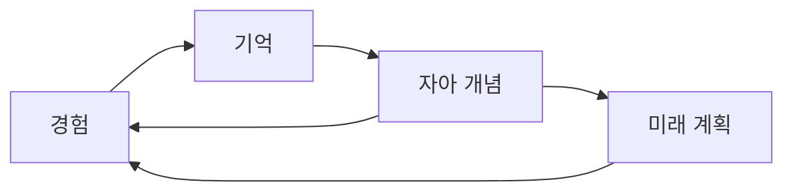

"나는 누구인가?"라는 질문은 인류가 가장 오래 고민해온 물음 중 하나다. 그런데 이 질문에 호프스타터(Douglas Hofstadter)의 《괴델, 에셔, 바흐》가 제시하는 "이상한 고리(Strange Loop)" 개념으로 접근하면, 놀라운 통찰들이 드러난다.

특히 "미래의 나를 타인처럼 느끼는" 현상과 고전적인 "테세우스의 배" 역설을 함께 살펴보면, 정체성의 본질과 더 충실한 삶을 사는 방법에 대한 깊은 이해를 얻을 수 있다.

---

## 이상한 고리: 자기 참조의 마법

호프스타터의 "이상한 고리"는 **시스템이 추상화의 여러 층을 거쳐 자기 자신을 다시 참조하는 현상**이다. 괴델의 불완전성 정리, 에셔의 착시 그림, 바흐의 푸가가 모두 이런 구조를 가지고 있다.

```
A는 B를 참조하고
B는 C를 참조하고
C는 다시 A를 참조한다
```

이때 놀라운 일이 일어난다. 단순한 구성 요소들이 복잡한 상호작용을 통해 **자아라는 환상**을 만들어낸다.

### 인간의 의식도 이상한 고리다

호프스타터는 인간의 의식 자체가 거대한 이상한 고리라고 주장한다:

- **뇌의 뉴런들**이 서로 연결되어
- **패턴과 상징**을 형성하고
- 이 상징들이 다시 **자기 자신을 가리키는** 구조

"나"라는 존재는 물리적 실체가 아니라, 뇌 속에서 지속적으로 생성되는 **자기 참조적 패턴**이다.

---

## 테세우스의 배: 연속성의 역설

고대 그리스의 테세우스 왕의 배는 오랜 항해를 하며 낡은 널빤지를 하나씩 교체했다. 모든 부품이 교체된 후에도 그것은 여전히 "테세우스의 배"인가?

### 두 가지 관점의 충돌

**실체론적 관점**: 물질이 바뀌었으니 다른 배다  
**기능론적 관점**: 구조와 기능이 같으니 같은 배다

둘 다 나름의 논리가 있지만, 완전한 답은 없다. 이것이 바로 **정체성의 역설**이다.

### 인간도 마찬가지다

인간의 몸도 끊임없이 변한다:
- 세포는 7년마다 거의 완전히 교체
- 뇌 뉴런도 일부는 평생에 걸쳐 재생
- 기억도 재구성되며 변화

그럼에도 우리는 자신을 "같은 사람"이라고 느낀다. 왜일까?

---

## 이상한 고리로 보는 정체성

호프스타터의 관점에서 보면, 정체성은 **고정된 실체가 아니라 지속적으로 자기를 참조하며 생성되는 패턴**이다.

### 자기 참조적 서사(Self-Referential Narrative)

"나"는 다음과 같은 순환 구조로 구성된다:

1. **경험**이 **기억**을 형성하고
2. **기억**이 **자아 개념**을 만들고  
3. **자아 개념**이 다시 **경험을 해석**하는 기준이 된다



이 과정에서 "나"는 고정된 실체가 아니라 **지속적으로 업데이트되는 패턴**임이 드러난다.

---

## 미래의 자아를 타인으로 느끼는 현상

심리학 연구에 따르면, 사람들은 **미래의 자신을 현재의 자신보다 타인에 가깝게** 인식한다. fMRI 실험에서 "10년 후 나"에 대해 생각할 때 뇌의 활동 패턴이 "타인"을 생각할 때와 유사하게 나타난다.

### 시간적 할인(Temporal Discounting)

이 현상은 **시간적 할인** 현상으로도 설명된다:
- 미래 보상의 가치를 현재 시점에서 할인
- 시간적 거리가 멀수록 할인율 증가
- 결과적으로 미래 자아에 대한 책임감 감소

### 이상한 고리 관점의 해석

이상한 고리 관점에서 보면, 이 현상은 **자기 참조 구조의 시간적 한계** 때문이다:

1. 현재의 자아 개념은 **현재의 기억과 경험**에 기반
2. 미래의 자아는 **가상의 경험과 기억**에 기반  
3. 두 참조 구조가 **충분히 연결되지 않아** 별개로 인식

---

## 미래 자아 연결의 실천적 의미

### 왜 미래 자아를 생생히 상상하면 더 충실하게 살까?

**1. 자기 참조 고리의 확장**

미래 자아를 구체적으로 상상하는 것은 현재의 자기 참조 구조를 미래까지 확장하는 것이다:

- **현재 나** ↔ **미래 나**의 연결 강화
- 미래 계획이 현재 행동에 더 강한 영향
- 장기적 관점의 의사결정 증가

**2. 서사적 정체성의 강화**

구체적 미래 상상은 **일관된 자아 서사**를 만든다:

```
"지금의 내 선택이 → 미래의 나를 만든다"
```

이 서사가 강할수록 현재 행동의 의미가 명확해진다.

### 구체적 실천 방법들

**1. 미래 자아 시각화**
- 5년 후, 10년 후 자신의 모습을 구체적으로 그려보기
- 단순한 목표가 아닌, 생생한 일상과 감정까지 포함

**2. 미래 자아와의 대화**
- "미래의 나라면 지금 어떤 선택을 할까?" 자문
- 중요한 결정 시 미래 관점에서 평가

**3. 시간적 연결고리 만들기**
- 현재 행동과 미래 결과의 인과관계 명확화
- 작은 습관의 장기적 누적 효과 인식

---

## 철학적 함의: 유동적 정체성과 책임

### 정체성은 선택이다

이상한 고리 관점은 정체성에 대한 새로운 이해를 제공한다:

- 정체성은 **발견하는 것이 아니라 창조하는 것**
- 매순간 **자기 참조적 선택**을 통해 "나"를 만들어감
- 과거와 미래를 현재로 연결하는 **서사의 주도권**이 우리에게 있음

### 책임과 자유의 역설

이는 흥미로운 역설을 만든다:

- **더 큰 자유**: 정체성을 고정된 운명이 아닌 선택으로 본다면
- **더 큰 책임**: 현재의 모든 선택이 미래 자아를 만든다면

### 실존적 의미

결국 "나는 누구인가?"라는 질문의 답은:

> "나는 지금 이 순간 선택하는 자기 참조적 패턴이며, 동시에 그 패턴을 선택하는 주체다"

---

## 더 충실한 삶을 위한 통찰

### 1. 현재와 미래의 연결 의식하기

매일의 작은 선택들이 어떻게 **자기 참조 고리**를 통해 미래의 나를 만드는지 의식하기.

### 2. 서사의 주도권 갖기

과거의 경험이 나를 정의하는 게 아니라, **내가 과거를 해석하고 미래를 설계**한다는 관점 유지하기.

### 3. 정체성의 유연성 받아들이기

변화를 정체성의 위기로 보지 말고, **지속적인 자기 창조 과정**으로 받아들이기.

---

## 결론: 정체성의 창조적 순환

호프스타터의 이상한 고리로 보면, 정체성은 다음과 같은 창조적 순환 구조다:

```
현재의 나 → 선택과 행동 → 경험과 기억 → 자아 개념 업데이트 → 새로운 현재의 나
```

테세우스의 배처럼, 우리는 끊임없이 변하면서도 연속성을 유지한다. 핵심은 이 과정을 **의식적이고 의도적으로** 진행하는 것이다.

미래의 자아를 타인으로 느끼는 것은 자연스러운 현상이지만, 그 연결을 강화할 수 있다. 미래를 생생하게 상상하고, 현재의 선택이 만드는 결과를 의식하고, 일관된 서사를 만들어가는 것.

결국 **"나"는 발견의 대상이 아니라 창작의 과정**이다. 매 순간 우리는 자신을 다시 쓰고 있다.

---

## Related

- [[샤워 생각이 철학 에세이가 되는 순간](/ai-philosophical-collaboration)] - 이 탐구가 어떻게 시작되었는지
- [[AI Native Mindset](/ai-native-mindset)] - 시스템 사고와 패턴 인식에 대해
- [[우리는 이미 에이전트와 일하고 있다](/working-with-agents)] - Agency의 철학적 의미

---

## 참고문헌

- Hofstadter, D. R. (1979). *Gödel, Escher, Bach: An Eternal Golden Braid*
- Hershfield, H. E. (2011). Future self-continuity: how conceptions of future selves transform intertemporal choice. *Annals of the New York Academy of Sciences*, 1235, 30-43.
- Parfit, D. (1984). *Reasons and Persons*. Oxford University Press.