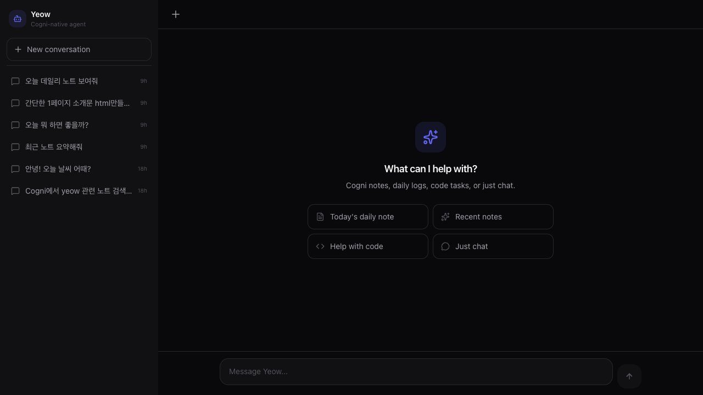

---
title: "에이전트가 자기 자신을 고치다 — Yeow Self-Modification Loop"
description: "AI 에이전트가 자신의 UI를 실시간으로 보면서 코드를 직접 수정하는 루프를 처음으로 경험했다."
pubDate: "2026-02-19"
---

> AI 에이전트가 자신의 UI를 보면서, 자신의 코드를 고치고, 결과가 즉시 반영되는 루프.

⸻

## 들어가며

오늘 처음으로 이상한 경험을 했다.

`localhost:5173`에서 Yeow의 UI를 보고 있었다. 그리고 **같은 Yeow에게** "이 UI 좀 고쳐줘"라고 말했다.

Yeow는 자기 자신의 소스 코드를 열고, 수정하고, 저장했다. Vite hot reload가 즉시 브라우저를 갱신했다. 대화는 끊기지 않았다.

에이전트가 자신의 렌더링 환경을 실시간으로 관찰하면서 스스로를 개선하는 루프 — 완전히 자율은 아니지만, 그 경계에 있는 무언가였다.



⸻

## 어떻게 가능했나

워크플로우는 단순하다:

1. **`localhost:5173`** (Vite dev server)에서 Yeow UI를 열어둔다
2. **같은 Yeow 인스턴스**에게 코드 리뷰나 UI 개선을 요청한다
3. Yeow가 `Read` / `Edit` / `Write` 도구로 `packages/web/src/ui/` 파일을 직접 수정한다
4. Vite HMR이 파일 변경을 감지해 **브라우저를 즉시 갱신**한다
5. WebSocket 연결은 유지된 채 UI만 교체된다 — 대화는 계속된다

특별한 인프라가 필요한 게 아니었다. Vite dev server + 파일시스템 접근 권한 + 대화 연속성, 이 세 가지의 조합이었다.

⸻

## 오늘 실제로 바꾼 것

`MessageBubble.tsx`를 리팩토링했다:

- **아바타 아이콘 제거** — 어시스턴트 메시지에서 Bot 아이콘 삭제
- **말풍선 제거** — `bg-surface` 박스 없애고 flat 텍스트로
- **hover 복사 버튼** — 양쪽 메시지 모두, hover 시 fade-in으로 드러나는 복사 버튼 추가

코드 리뷰도 같이 받았다. stale closure 위험, WebSocket 끊김 방어 코드 누락, `setTimeout` 하드코딩 등 — 직접 쓴 코드를 같은 에이전트가 비판적으로 보는 것도 묘한 경험이었다.

⸻

## 의미하는 것

완전한 자율 개선 루프는 아니다. 방향은 내가 잡고, 에이전트가 실행한다.

하지만 흥미로운 건 **피드백 루프의 속도**다. 일반적인 개발 흐름은 이렇다:

```
요청 → 코드 수정 → 빌드 → 확인 → 다시 요청
```

여기선:

```
요청 → 수정 → 즉시 확인 (→ 다시 요청)
```

에이전트가 결과를 "보면서" 다음 액션을 결정할 수 있는 구조가 된다. 이게 쌓이면 단순한 코드 실행 도구가 아니라, 관찰-판단-실행 루프를 가진 뭔가가 된다.

⸻

## 마치며

아직은 작은 실험이다. 하지만 에이전트가 자신의 환경을 인식하고, 그 환경을 수정하고, 결과를 즉시 확인할 수 있다는 것 — 이 조합이 앞으로 어디까지 갈 수 있을지 궁금하다.

Yeow는 계속 만들어가는 중이다.

